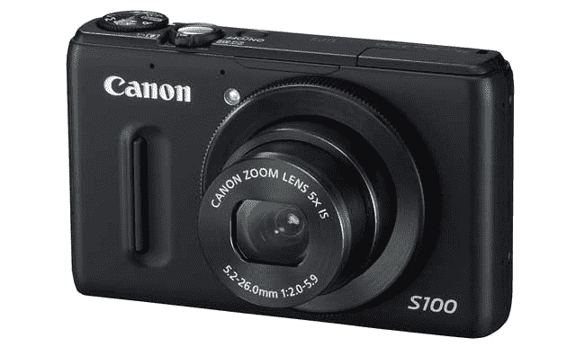
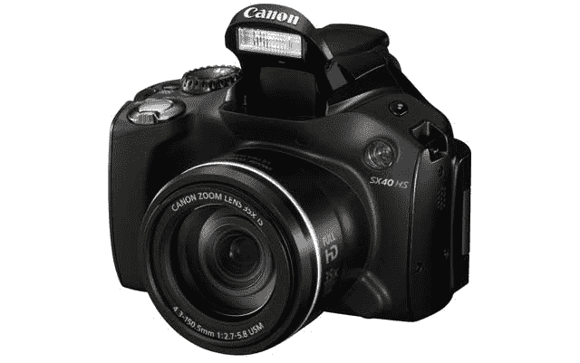

# 佳能更新经典 PowerShot 相机，发布 S100 和 sx40hs TechCrunch

> 原文：<https://web.archive.org/web/http://techcrunch.com/2011/09/15/canon-powershot-s100-sx40/>

# 佳能更新经典 PowerShot 相机，发布 S100 和 SX40 HS

佳能今天早上发布了两款重要的新型傻瓜相机。PowerShot S100 取代了备受喜爱的 S95，而 PowerShot SX40 HS 成为该公司最新的超级变焦相机。两者都以可观的价格点上市，并带来了令人印象深刻的新功能，包括 DiGiC 5 处理器，该处理器承诺更好的低捕捉、更高的色彩精度和更低的数字噪声——你知道，总体性能优于上一版本。

S100 有大，但如果你愿意，身体上的小，鞋子要填满。这个小射手可能看起来像任何 ol' pocket 类型，但它实际上包含了一个令人印象深刻的功能集，并有望跟随它的前辈 S95 一样成为摄影明星。你看，S95 几乎因其令人印象深刻的弱光能力和出色的 f2.0 镜头而受到普遍喜爱。不过电池续航差，视频拍摄也仅限于 720p。S100 应该可以解决这两个问题。

CMOS 传感器位于比 S95 中使用的略宽略长的 f2.0 镜头后面。以前型号中使用的 CCD 芯片已经消失，但这种新的传感器允许 1080p 视频捕捉和 6400 的 ISO，是 S95 的两倍。该相机还采用了新的 DiGiC 5 处理器，在上述功能中，它允许令人印象深刻的突发模式，称为高速突发 HQ，以每秒 9.6 张照片的速度在全分辨率下捕捉 8 帧*。这种连拍模式也出现在下面的 SX40 上，是佳能的第一个全分辨率模式，因为以前的版本将分辨率降至 2MP。*

尽管保留了多功能镜头环、3 英寸后置 LCD 面板和新的集成 GPS 芯片，S100 的外壳甚至比已经可以放入口袋的 S95 还要小。预计 S100 将于 11 月初上市，售价 429 美元。

 
Ths SX40 HS 取代了老化的 SX30 IS。它的售价与旧款相同，为 429 美元，但配备了与 S100 相同的 12.1 百万像素传感器和数字处理器。这允许 1080p 记录和高速连拍捕捉，但通过 SX30 IS 中使用的相同 35x IS 镜头的眼睛。这个巨大的 150.5 毫米，f2.7 镜头需要一个同样巨大的相机外壳，似乎佳能也采用了旧的外壳。但尽管如此，由新图像处理器驱动的新传感器可能会使 SX40 成为一个有价值的继任者。