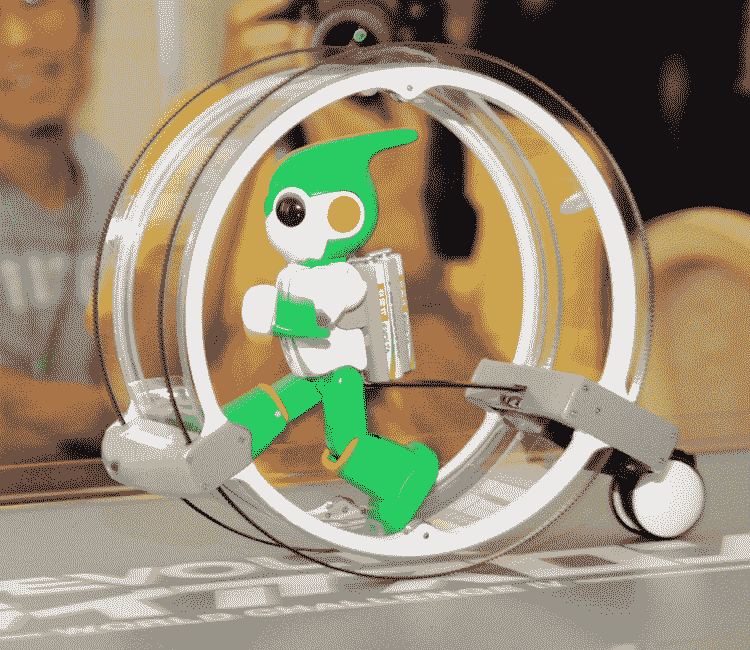
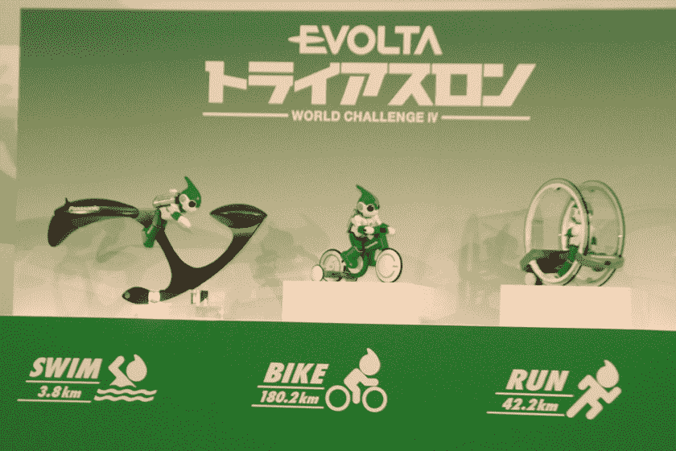

# 视频:松下的 EVOLTA 迷你机器人将在夏威夷铁人三项赛 TechCrunch 上起跑

> 原文：<https://web.archive.org/web/http://techcrunch.com/2011/09/15/video-panasonics-evolta-mini-robot-to-start-at-the-hawaii-ironman-triathalon/>

# 视频:松下的 EVOLTA 迷你机器人将参加夏威夷铁人三项赛

松下确实知道如何推广他们的充电电池品牌 EVOLTA T1:首先，一个由电池供电的可爱迷你机器人在大峡谷 T3 将自己吊上了 T2 500 米的悬崖，然后一个 EVOLTA 机器人参加了 T4 勒芒 24 小时耐力赛 T5，然后在去年从东京到京都 500 公里的 T6 比赛 T7。

现在，松下[宣布](https://web.archive.org/web/20230203071340/http://panasonic.co.jp/corp/news/official.data/data.dir/jn110915-2/jn110915-2.html)【JP】计划让这个小家伙参加 10 月 24 日在夏威夷举行的[铁人三项赛](https://web.archive.org/web/20230203071340/http://en.wikipedia.org/wiki/Ironman_Triathlon)(该公司将在下个月推出一系列改进的 EVOLTA 电池)。换句话说，机器人应该游泳 2.4 英里，在跑马拉松(26.2 英里)之前骑自行车 112 英里——所有这些都由 EVOLTA 电池供电。

松下表示，他们将在每项挑战中使用一个特殊的机器人(见下文)，他们将在途中给电池充电(毕竟，整个比赛长达 140 英里)。

松下预计 EVOLTA 机器人将在大约一周的时间内完成铁人三项。我们会随时通知你。

下面是一个展示游泳模特的视频([跑步](https://web.archive.org/web/20230203071340/http://www.youtube.com/watch?v=ka1QZrWdBq8)、[骑车](https://web.archive.org/web/20230203071340/http://www.youtube.com/watch?v=yPG8gzWCUyc)):
【YouTube = http://www . YouTube . com/watch？v = 9 ao 3d y38 ygc&w = 560&h = 315】

Via [卡丹手表](https://web.archive.org/web/20230203071340/http://kaden.watch.impress.co.jp/docs/news/20110915_477647.html) [JP]