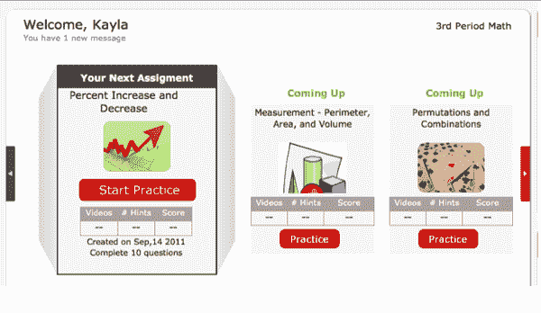

# TenMarks 为个性化数学学习 SaaS TechCrunch 筹集了 300 万美元

> 原文：<https://web.archive.org/web/http://techcrunch.com/2011/09/16/tenmarks-raises-3-million-for-personalized-math-learning-saas/>

# TenMarks 为 SaaS 个性化数学学习筹集了 300 万美元

教育科技初创公司 TenMarks 已经筹集了 300 万美元的新资金，由 Catamount Ventures 领投，Birchmere Ventures 参与其中。[詹姆斯·华金](https://web.archive.org/web/20230204230628/http://www.crunchbase.com/person/james-joaquin)、[在](https://web.archive.org/web/20230204230628/https://techcrunch.com/2011/09/07/former-xmarks-ceo-and-serial-entrepreneur-james-joaquin-joins-catamount-ventures-as-partner/) [Catamount Ventures](https://web.archive.org/web/20230204230628/http://www.crunchbase.com/financial-organization/catamount-ventures) 的新合伙人，将加入 TenMarks 董事会。

TenMarks 提供基于云的服务，提供个性化的练习和学习软件，帮助教授不同技能水平的学生数学概念。TenMarks 旨在补充课堂教学，并根据学生的能力就他们在课堂上涉及的主题分配工作。学生使用提示和短视频课程来更新他们所知道的和学习他们不知道的。

TenMarks 的另一个版本使教师能够为每个学生创建个性化的课程(称为播放列表)，其中包含不同年级的数学概念。TenMarks Math 可供教师和学生免费使用，在过去的 6 个月里，全美 50 个州的 15，000 多个教室和 250，000 名学生使用了 TenMarks Math。

这家初创公司表示，它的软件正在看到有意义的结果。在加利福尼亚州雷德伍德城的珠穆朗玛峰公立高中进行的一项研究表明，使用 TenMarks Math 的学生在 6 周的时间内数学成绩提高了 36%，平均学生成绩提高了 10%。加利福尼亚州诺瓦托的另一所小学在暑假期间为学生使用了 10 分制，发现超过 80%使用 10 分制的学生在暑假后得分更高，而不是预期的下降。

毫无疑问，技术正在改变我们学习和教育的方式，随着越来越多的教师和机构赶上这一趋势，像 TenMarks 这样的初创公司应该会看到更多的增长。

