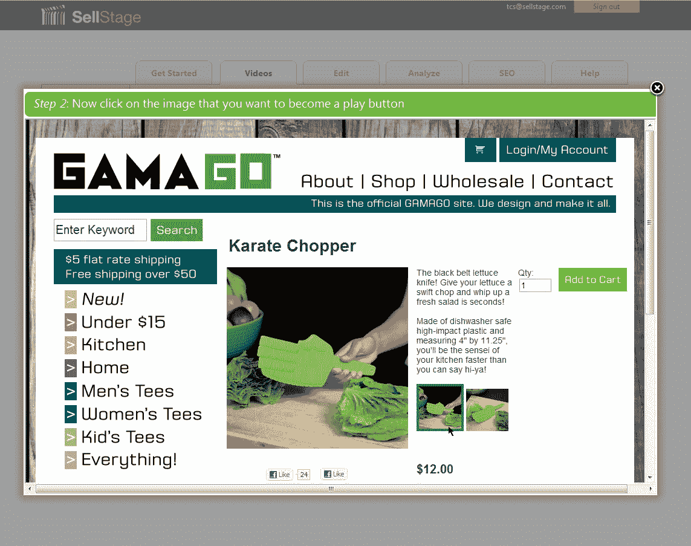

# Y Combinator 支持的 SellStage 希望通过视频帮助您更好地展示您的产品 TechCrunch

> 原文：<https://web.archive.org/web/http://techcrunch.com/2011/09/16/y-combinator-backed-sellstage-wants-to-help-you-better-showcase-your-products-with-video/>

如果你在为一个产品做广告，你是想简单地拥有这个产品的图片，还是让你的消费者能够观看这个产品的视频？除非你像我一样讽刺，否则你可能会回答后者，因为事实是视频有助于产品在网上销售。这是真的，即使对于那些销售产品的供应商来说，人们不一定会认为视频会更有吸引力。以 Zappos 为例，它目前提供超过 50，000 个产品视频。Zappos 的生意也非常好。

对于从今年夏天的一批 Y Combinator 公司中脱颖而出并于今日上市的初创公司 SellStage 来说，Zappos 就是标准。但就视频内容而言，大多数大型零售商都远远落后于鞋店。因此，SellStage 推出了一个平台，旨在让大型和小型企业都能轻松地在网站上添加视频内容，以展示他们的产品。

产品视频往往与其他视频内容大相径庭，因此它需要一个特定的(如果不是小众的)解决方案。视频也很难与产品页面集成，因为你不能只采用普通的嵌入方法，因为它会占用太多空间，甚至可能取代产品图像。

因此，SellStage 不仅希望托管和播放您的产品视频，还希望在 lightbox 中播放它们。所以在你的产品视频播放后，你需要一个行动号召，而不仅仅是一个重播链接。当然，SEO 是重要的电子商务网站，大多数产品视频没有考虑到这一点，所以 SellStage 会自动生成针对视频搜索爬虫优化的网站地图。

在商家方面，SellStage 提供了巨大的价值主张，因为你所要做的就是在产品页面上添加一行 Javascript，而初创公司会处理其余的事情，即播放器、托管和流媒体。然后，只需点击几下鼠标，您就可以将视频拖放到您想要的位置。

更重要的是，SellStage 视频可以在 iOS 设备上工作，而很多产品视频都不能，因为它们使用了 Flash。这家初创公司还在开发一些工具，让视频制作变得更容易，包括这款即将推出的 iOS 应用，以及一些“你拍摄，销售阶段编辑”类型的功能。

这家初创公司虽然仍处于早期形式，但对于希望管理其电子商务平台上的视频的营销部门来说将非常有用，特别是对于那些拥有大量产品目录并希望添加 500 多个视频而不是将其变成 500 个 IT 请求的人来说。

SellStage 的联合创始人汤姆·萨费尔说:“认为自己的专业知识是竞争优势的零售商需要找到一种方法来利用他们最大的资产——他们知识渊博的销售人员。”。“让他们的网上商店与众不同。视频让他们这样做”。

联合创始人托马斯·埃斯库尔鲁说，零售商已经拥有了制作优秀视频所需的一切:商店已经布置好，销售人员就是演员，剧本就是你在商店里对顾客说的任何话——你的推销词。

但是 SellStage 如何赚钱呢？联合创始人告诉我，他们将建立一个分层定价结构，考虑公司想要制作、托管和播放多少视频，以及他们是否需要 SellStage 本身的制作帮助。随着这家初创公司的发展，它也将开始为客户提供更多的定制选项。

SellStage 今天将在 private alpha 中推出，但将向读者提供 50 个优先邀请。只需访问这家初创公司的主页，输入“协和”就可以先睹为快。