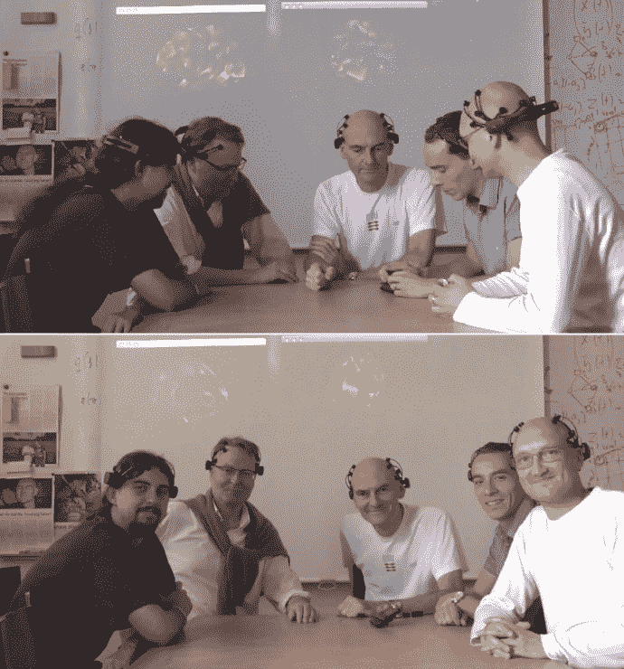

# 智能手机驱动的脑电图让令人毛骨悚然的会议成为可能

> 原文：<https://web.archive.org/web/http://techcrunch.com/2011/09/19/smartphone-powered-eeg-makes-for-creepy-meetings/>

# 智能手机驱动的脑电图让会议变得令人毛骨悚然

丹麦技术大学组装了一个便携式脑电图系统，由一个低成本的头皮监视器和一个智能手机应用程序组成。这不是最大的技术突破，但我觉得看到这些比我们几年前的个人电脑更强大的口袋电脑被用于社交媒体以外的东西，并找到最近的星巴克，这让我感到欣慰。

milab 的团队是 DTU 认知系统部门的一部分，专注于“移动环境感知、媒体建模和用户体验”因此，他们很自然地想要组装类似于手持脑电图仪的东西。这确实是一个相当简单的系统:一个商用的 [Emotiv](https://web.archive.org/web/20230205041834/http://emotiv.com/store/hardware/epoc-bci/epoc-neuroheadset/) 耳机连接到一个无线 USB 接收器，该接收器又连接到诺基亚 N900。

【YouTube http://www.youtube.com/watch?v=i_66KAOzXhU]

来自 EEG 的数据(来自联系人周围区域的实时总活动数据)被手机立即解密，并转换成基于 3D OpenGL 的动画。从读取到显示的总时间约为 150 毫秒。这样就可以进行快速的现场监控，而无需在工作站内来回走动或安装笔记本电脑。简单的部署和自然的设置对心理学实验非常重要，我知道一个事实，在*式的*上安装一个全套的、凝胶增强的、无处不在的脑电图帽会干扰你正常的思维过程。

它似乎可以解码大脑状态，足以执行一些基本的动作，如滚动画廊或打开和关闭应用程序。然而，最伟大的事情是他们似乎发明了一种新的会议方式:

这让我想起了在[神奇星球](https://web.archive.org/web/20230205041834/http://en.wikipedia.org/wiki/Fantastic_Planet)中蓝色巨人主持的会议。将来在 AOL 我们会被要求穿这些吗？如果我们在人力资源讲座中没有保持适当的阿尔法频率，我们会被震惊而屈服吗？仁慈！

[via [Reddit](https://web.archive.org/web/20230205041834/http://www.reddit.com/r/technology/comments/kkjk1/scan_your_brain_using_a_smartphone/)