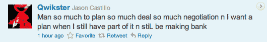
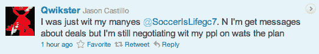
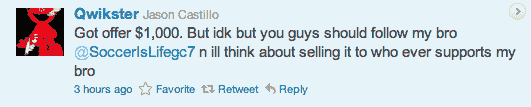

# Qwikster Twitter 账户背后的人意识到他拥有什么，想要一大笔钱 TechCrunch

> 原文：<https://web.archive.org/web/http://techcrunch.com/2011/09/19/the-guy-behind-the-qwikster-twitter-account-realizes-what-he-has-wants-a-mountain-of-cash/>

# Qwikster Twitter 账户背后的人意识到他拥有什么，想要一大笔钱

昨晚，杰森像一个普通人一样上床睡觉，有一个普通的推特账户(尽管头像是抽大麻的埃尔莫)，和几十个粉丝。

今天早上，Jason 醒来时发现一个装满邮件的收件箱，有成千上万的新粉丝，他想以几千美元的价格卖掉他的账户。

正如我们昨晚所记录的，网飞在推出他们的新衍生品牌 Qwikster 时犯了一个相当根本性的错误:在宣布之前，他们没有确保在所有大型社交网络*上锁定这个名字。幸运的是，杰森很早就拥有了@Qwikster 这个用户名。他愿意放弃它——他只是想确保自己先“赚到钱”。*

经过一个多月的沉寂，Jason 的@Qwikster 账户在几个小时前又恢复了活力，并且可能让网飞感到恐怖的是，今天比以往任何时候都更加活跃。Jason 在充满诗意的突发事件中不断提及销售客户的想法，如“我正要去踢足球，我被一只该死的蜜蜂绊倒了”和“我只是害怕，我走进浴室打开水，然后东西开始掉落，我喜欢 omg wtf lol”:

杰森似乎已经召集了他的朋友加布里埃尔( [@SoccerIsLifegc7](https://web.archive.org/web/20230203103054/https://twitter.com/#!/SoccerIsLifegc7) )的专家顾问，他说他们“在出价达到 6 位数之前不会谈”。

或许应该有人告诉杰森，出售 Twitter 手柄是严格违反 Twitter 的[服务条款](https://web.archive.org/web/20230203103054/https://support.twitter.com/entries/18370)的，试图这样做很快就会导致 banhammer 被撤销。然后 Qwikster 免费得到他们的名字。