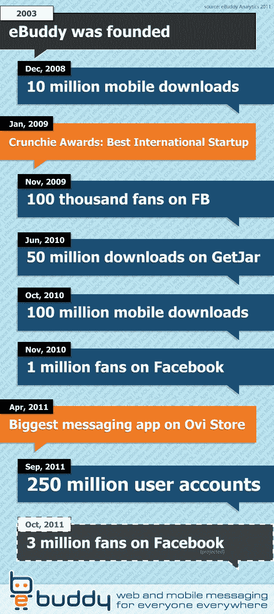

# eBuddy 突破 2.5 亿用户账户，Android 增长 300%

> 原文：<https://web.archive.org/web/http://techcrunch.com/2011/09/21/ebuddy-blows-through-250-million-user-accounts-android-up-300/>

# eBuddy 突破 2.5 亿用户账户，Android 增长 300%

**独家——**[荷兰公司 eBuddy](https://web.archive.org/web/20230326025619/http://www.crunchbase.com/company/ebuddy) 称，这是第一款用户账户超过 2.5 亿的独立消息应用，该公司让全球数百万人能够通过网络和各种手机相互交流。

eBuddy 说，这些新用户中有很多是使用 Android 手机的人，假设在这个特定平台上的增长比去年同期增长了 300%。

当然，并不是所有的 2.5 亿用户账户都是活跃的，但你会惊讶地发现有多少账户是活跃的——至少根据 eBuddy 的说法，他说每年有 1.63 亿账户是活跃的，并且 [eBuddy Messenger](https://web.archive.org/web/20230326025619/http://www.ebuddy.com/mobile.php) 的用户目前每月花费*超过 100 亿分钟*使用该应用。

脸书聊天在 eBuddy 的用户中也很受欢迎，迄今为止已经下载了 1 . 3 亿个应用程序:脸书的即时通讯服务使用量同比增长了 144%。

这家荷兰公司最近[推出了 eBuddy XMS](https://web.archive.org/web/20230326025619/https://techcrunch.com/2011/03/17/sms-on-steroids-ebuddy-debuts-realtime-cross-platform-messaging-app/) ，这是一款免费的智能手机实时消息应用，但没有提供任何具体的统计数据。

eBuddy 成立于 2003 年，总部位于阿姆斯特丹，在伦敦、新加坡和旧金山设有办事处，是一家由 Prime Ventures 和 Lowland Capital Partners 支持的私人控股公司。

公告附带的看似强制性的信息图:

