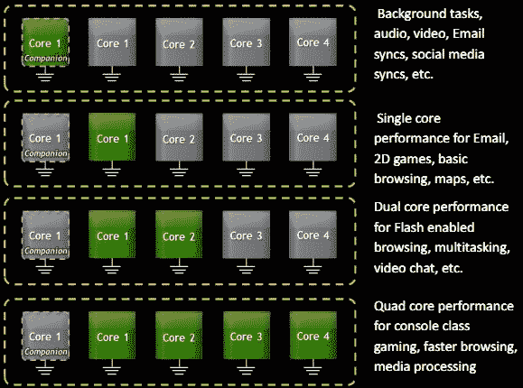

# Nvidia 揭示 Kal-El 用于超低功耗任务的秘密第五核心 TechCrunch

> 原文：<https://web.archive.org/web/http://techcrunch.com/2011/09/21/nvidia-reveals-kal-els-secret-fifth-core-for-ultra-low-power-tasks/>

# Nvidia 揭示了 Kal-El 用于超低功耗任务的秘密第五核心

自从 Nvidia 的下一代 Tegra 芯片在二月的路线图上第一次详细说明以来，已经有很多关于它的传言，代号为 Kal-El(超人的氪星名字，对于外行人来说)。但它还没有出现在任何实际的手机或平板电脑中，尽管[我们被告知它已经被大公司](https://web.archive.org/web/20230205001414/https://techcrunch.com/2011/05/17/nvidia-ceo-android-will-overtake-ios-on-tablets-in-30-months/)采用，并将很快首次亮相。

Nvidia 今天发布了一些关于 SoC 的[新信息](https://web.archive.org/web/20230205001414/http://blogs.nvidia.com/2011/09/quad-core-kal-el%E2%80%99s-stealth-fifth-core-lets-it-save-on-energy/)，证实了 Tegra 在移动计算世界中的品牌地位。原来不是四核，是*五*核。“伙伴核心”被设计成在所有其他核心进入睡眠时接管工作。

正如您可能已经怀疑的那样，负载平衡和优化处理器使用对于许多设备的电池寿命非常重要。屏幕通常更大，但随着对 CPU 和 GPU 密集型内容的需求增加，用于处理的电池部分也在增加。但当你不在手机上玩游戏或看高清电影时，这些高功率内核的运行效率不如专为低功率、低优先级任务设计的内核。因此，Nvidia 又推出了一款低功耗优化内核，它可以在手机不活动时接管通知监控等日常事务，以及电子阅读等低带宽事务。

Nvidia 在这张方便的图表中解释了这一切，尽管要注意沾沾自喜的行话(“游戏机级游戏”不是行业标准术语):

这有点像在你的车库里有一辆城市汽车和一个热棒。你不想在拥挤的交通中驾驶你的阿斯顿·马丁。这就是为什么你也有一辆思域，或者一辆聆风。我也是。为什么要使用十倍于执行简单任务所需的 CPU 能力？

[你可以在 Nvidia 的白皮书](https://web.archive.org/web/20230205001414/http://www.nvidia.com/content/PDF/tegra_white_papers/tegra-whitepaper-0911b.pdf) (PDF)中阅读其余内容，但要有所保留，因为 TI 可能会有一些锦囊妙计，甚至英特尔也可能会悄悄靠近。