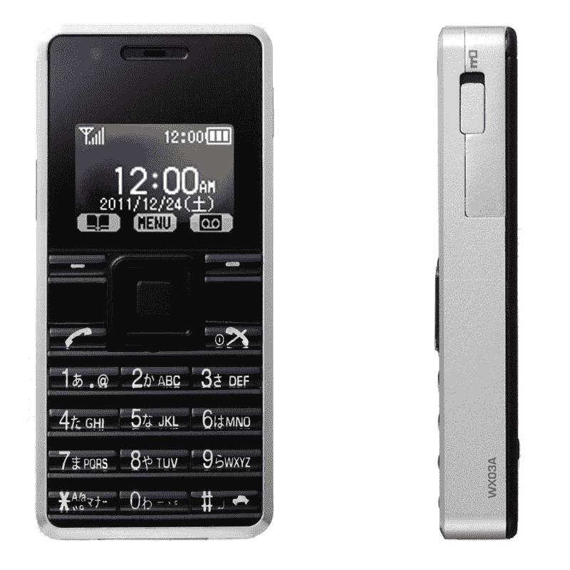
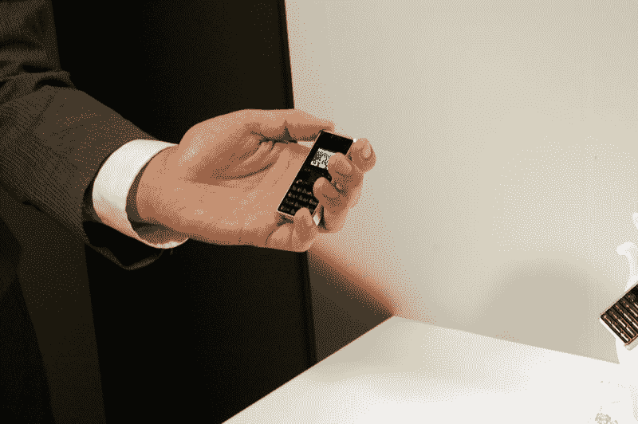
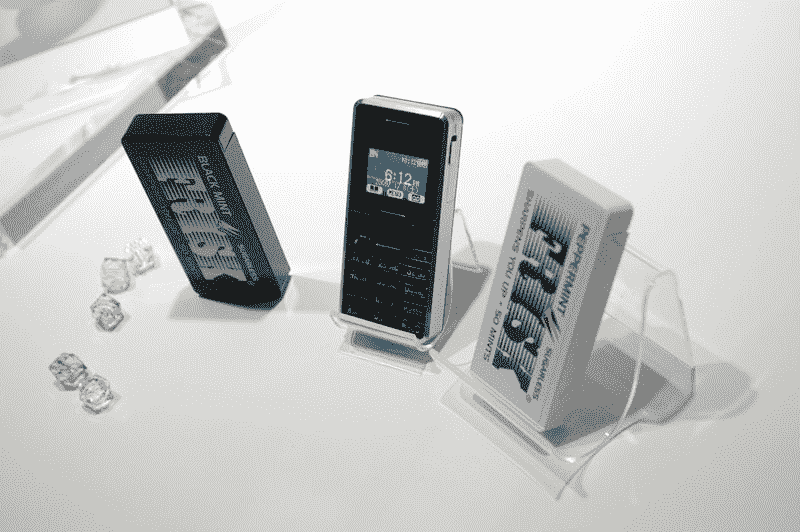

# WX03A:世界上最小最轻的 PHS 手机在日本亮相 TechCrunch

> 原文：<https://web.archive.org/web/https://techcrunch.com/2011/09/21/wx03a-worlds-smallest-and-lightest-phs-cell-phone-unveiled-in-japan/>

# WX03A:世界上最小最轻的 PHS 手机在日本亮相

日本移动运营商 [Willcom](https://web.archive.org/web/20230205012327/http://www.willcom-inc.com/en/index.html) 今天[宣布](https://web.archive.org/web/20230205012327/http://www.willcom-inc.com/ja/corporate/press/2011/09/21/)【JP】WX03A，这是世界上最小的符合 [PHS](https://web.archive.org/web/20230205012327/http://en.wikipedia.org/wiki/Personal_Handy-phone_System) 标准的十键手机(Willcom 是日本唯一支持该网络系统的电信公司)。该公司将这款设备作为一款“背包”大小的手机进行营销，事实上，它非常小。

尺寸为 W32×h70×d 10.5 毫米，比已经很小的[Palm Pixi](https://web.archive.org/web/20230205012327/https://techcrunch.com/2009/04/30/palm-eos-is-this-the-mini-pre/)(55x 111 x 10.85 毫米)更小，重量为 40 克，也轻得多(Pixi 重 100 克)。

 

WXo3A 配备了 1 英寸的有机发光二极管屏幕和一个 microUSB 端口，并提供 300 小时的待机时间(2 小时的通话时间)。

Willcom 计划于 12 月开始在日本销售这款手机。

Via [京台手表](https://web.archive.org/web/20230205012327/http://k-tai.impress.co.jp/docs/news/20110921_478165.html) [JP]