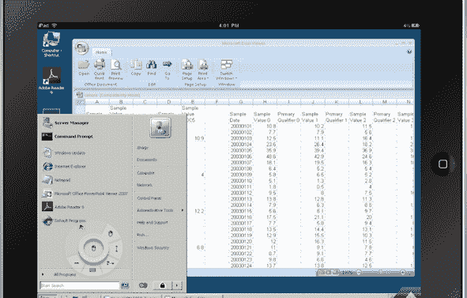

# Wyse 发布新版云存储应用 PocketCloud | TechCrunch

> 原文：<https://web.archive.org/web/http://techcrunch.com/2011/09/21/wyse-releases-new-version-of-cloud-storage-app-pocketcloud/>

# Wyse 发布新版云存储应用 PocketCloud

云存储应用 PocketCloud 的开发者 Wyse Technology 今天发布了其服务的新版本，通过让你从移动设备控制 PC 上的任何东西，可以将智能手机和平板电脑变成虚拟桌面。PocketCloud 利用客户在 Mac、PC 和虚拟桌面上的现有存储，而不是将文件存储在第三方服务器上。Wyse 的个人云每月收费 1 美元，可实现无限存储。

对于其他服务，一旦用户的文件被上传到云端，控制这些数据的隐私和安全就变成了第三方的责任。Wyse 提供对安全存储在用户设备上的文件的远程访问，并且不限制可以在个人设备之间共享的文件的数量或类型。

新版 PocketCloud 允许在你的 iPhone、iPad 和电脑之间无限制地共享任何类型的文件，每月只需 1 美元。因此，您可以链接设备，并在这些设备之间共享音乐和其他文件。PocketCloud 还支持 OS X (Lion)用户帐户认证，并支持 iPad 2 视频镜像。

Wyse 声称，他们能够以很少的成本为你提供与亚马逊、DropBox 和其他公司相同的功能。但随着苹果即将推出 iCloud，我们将看到 PocketCloud 能否留住用户，尤其是 iOS 用户。

[YouTube http://www.youtube.com/watch?v=wuE4MCI2hmo&w=560&h=315]