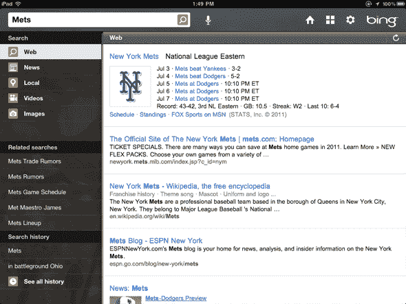

# 必应流血数十亿，微软应用止血带 TechCrunch

> 原文：<https://web.archive.org/web/https://techcrunch.com/2011/09/22/as-bing-bleeds-billions-microsoft-applies-tourniquet/>

Bing 是一个不错的搜索引擎。我再重复一遍:必应不是一个糟糕的搜索引擎。但是当你想知道去一个地方的方向，想买些新东西，或者只是好奇这个或那个是什么意思时，你可能不会对自己说:“哦，我要那个。”不不不你去谷歌一下那个混蛋。因为谷歌是个动词。而必应不是。

这就是微软的问题所在。自 2009 年成立以来，微软已经在必应上损失了 55 亿美元。目前，每季度亏损约 10 亿美元。但是等等——情况变得更糟了。在 Bing 还不是一个家喻户晓的名字之前，微软的在线服务部门没有赚到任何钱。事实上， [CNN Money](https://web.archive.org/web/20230203141249/http://money.cnn.com/2011/09/20/technology/microsoft_bing/index.htm?source=cnn_bin) 计算出，自 2007 年微软开始展示该部门的账目以来，该公司已经总共损失了 90 亿美元。

但是即使微软损失了数十亿美元，仍然有希望获得市场份额，对吗？呃，不完全是。据 comScore 报道，Bing 的市场份额确实从推出时的 8.4%上升到了目前的 14.7%。问题是，大坏蛋谷歌在这段时间里损失了 0.02%的份额，目前占有 64.8%的市场份额。那么，所有这些市场份额来自哪里？

超过一半的 6.3%的市场份额来自雅虎！。唯一的问题是，[必应支持雅虎搜索](https://web.archive.org/web/20230203141249/https://techcrunch.com/2011/07/13/binghoo-gains-search-share/)，所以获得的市场份额实际上只是一个搜索合作伙伴的蚕食。太棒了。

因此，总而言之，微软在必应之前亏损了数十亿美元，在必应上继续亏损，市场份额的增加只是通过搜索合作伙伴吃掉了自己的成功，没有任何迹象表明竞争对手谷歌受到了影响。是啊，看起来不太好。

但显然在线服务公司老板陆弃有一个计划。首先要做的事情是尽可能地将必应与微软的其他产品整合在一起。与[诺基亚](https://web.archive.org/web/20230203141249/https://techcrunch.com/2011/02/10/nokia-confirms-microsoft-partnership-new-leadership-team/)和[脸书](https://web.archive.org/web/20230203141249/https://techcrunch.com/2011/02/17/bing-friends-facebook-with-new-version-of-toolbar/)的合作，以及在 Xbox 360 中实现必应搜索都是朝着正确方向迈出的步伐。你看，必应用得越多，它就越擅长直观搜索。最终结果意味着非常非谷歌的东西。“我们并没有试图超越谷歌，”陆说。

取而代之的是，微软希望必应成为一个搜索工具，不再需要鲁所说的“穴居人语言”，也不再需要使用无介词、无冠词的基于名词的查询来找到你要找的东西。陆想让你用自然语言问冰一个问题。从那里开始，结果将不再是一个链接列表，而是一组选项，你可以从中选择搜索的方向。

如果你玩过[必应 iPad 应用](https://web.archive.org/web/20230203141249/http://itunes.apple.com/us/app/bing-for-ipad/id418435837?mt=8)，你就知道我在说什么了。例如，搜索“墨西哥卷饼”将显示与搜索“扬基队球票”不同的过滤器墨西哥卷饼提供了食谱，当地的墨西哥卷饼店，以及你的经典网页，图片和视频标签。洋基队门票，另一方面，带来了洋基队的官方售票网站，以及所有不同的地方购买具有可比价格的门票。换句话说，Bing 希望通过更少的点击，更快地给你找到你想要的东西。

【T2

这很好，但谷歌仍然是个问题。Bing 的老板 Stefan Weitz 解释说，“我们的挑战是，没有人在早上醒来时说，‘我真希望有一个更好的搜索引擎’，这就是为什么对我们来说，它总是关于如何完成比我们认为搜索引擎可能做到的更多的事情。最终，人们会期望用搜索做更多的事情，如果做不到，他们会感到失望。”

但是，在什么情况下，有人会跳上谷歌，对搜索结果如此失望，以至于说，“也许我应该试试必应。”当我在谷歌上找不到我要找的东西时，我认为这是我自己查询的错误，并尝试再试一次。在任何时候我都不会拉起冰。

话又说回来，一旦你习惯了必应，它实际上比谷歌有一些优势，我提到的直观过滤器就是其中之一。但是人们必须使用它来了解这一点，并且习惯于让 Bing 成为他们的首选搜索引擎。如果这还不够困难的话，谷歌拥有几乎所有的移动搜索领域，iOS Safari 浏览器内置了一个谷歌搜索栏，几乎任何 Android 设备的主屏幕上都有一个漂亮的小谷歌搜索栏。

但是，让我们说，通过一些想象，必应开始获得更多的市场份额。盈利仍然是一条很好的道路。据接受 CNN 采访的分析师称，必应需要至少 25%到 30%的市场份额才能开始赚钱。但韦茨说，必应有谷歌没有的东西:灵活性。

当谷歌对其搜索进行调整时，这种微小变化的冲击波会影响搜索者、广告商和网站的整个生态系统。谷歌在努力改进时必须格外小心，以免迷惑或惊吓其数十亿用户。另一方面，必应可以随心所欲地进行实验，而不会冒险惹恼任何人。因为没人真正使用它。

我并不是说必应注定失败——恰恰相反。正如我多次说过的，必应是一个伟大的产品。但是让人们改变像吃饭和睡觉这样根深蒂固的习惯是一项非常艰巨的任务。祝你好运，微软。