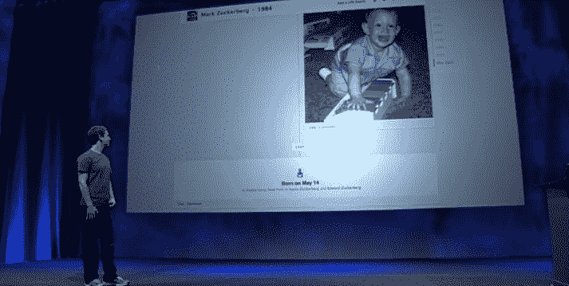

# 脸书揭开时间线:在一页纸上讲述你的生活

> 原文：<https://web.archive.org/web/https://techcrunch.com/2011/09/22/facebook-timeline/>

# 脸书揭开时间线:在一页纸上讲述你的生活

今天，在脸书的 f8 大会上，首席执行官马克·扎克伯格上台展示了这项服务的下一步发展。第一大变化？侧写。

扎克伯格指出，最初的个人资料有点像你生命中的最后五分钟。2008 年更新的个人资料扩展了这个范围，显示了你生活的最后 15 分钟。扎克伯格指出，今天公布的新档案是“其余的”。他称这个特征为时间线。

“这是你脸书体验的核心，完全从头重新思考，”扎克伯格说，并指出他们已经为此工作了一年。"时间线是你生活的故事。"

扎克伯格展示的是一个漂亮的新个人资料，比脸书以前做过的任何东西都更加直观。老实说，它看起来有点像一个非常好的 Tumblr 博客。它有三个主要部分:

*   你所有的故事
*   你的所有应用
*   表达自我的新方式

这要追溯到你出生的时候。

扎克伯格指出，试图展示所有这些内容是一个重大的设计挑战。你是如何在一个页面上做到这一切的？你最近的所有内容都显示在一个新的网格视图中。但随着时间的推移，更多的是总结你的内容，以显示最重要的内容。越往后看，看到的越少——只是关键时刻。“这就是时间线的神奇之处，”扎克伯格说。

它也适用于手机。虽然扎克伯格主要展示了时间轴在网络上的外观，但他也在较小的 iPhone 屏幕上展示了它。同样的想法，只是更浓缩而已。

“我们想设计一个像你家一样的地方，”扎克伯格说。

毫无疑问，这将随着时间的推移而推出(首席技术官 Bret Taylor 说，在接下来的几个月里)。你可以在这里了解更多关于时间线[的信息。](https://web.archive.org/web/20230330002059/https://www.facebook.com/about/timeline)

**更新** : [这是时间线的样子](https://web.archive.org/web/20230330002059/https://techcrunch.com/2011/09/22/facebook-timeline-pictures/)。

**更新 2** : [在设计与数据的交汇处，脸书时间轴诞生](https://web.archive.org/web/20230330002059/https://techcrunch.com/2011/09/22/facebook-timeline-birth/)

