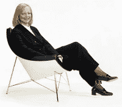

# 惠普官方宣布:李艾科出局，梅格·惠特曼被任命为总裁兼首席执行官 TechCrunch

> 原文：<https://web.archive.org/web/http://techcrunch.com/2011/09/22/its-official-at-hp-apotheker-is-out-meg-whitmen-named-president-and-ceo/>

# 惠普官方宣布:李艾科出局，梅格·惠特曼被任命为总裁兼首席执行官

李艾科于 2010 年 9 月 30 日被任命为惠普公司的总裁兼首席执行官。不到一年后的今天，他离职了，惠普董事会任命梅格·惠特曼接替他的职位。很大的惊喜，对吧？

在李艾科的领导下，惠普的股票损失了近一半的价值，基本上挥霍了马克·赫德在 Palm 的 12 亿美元投资，并宣布该公司正在考虑取消或剥离其消费 PC 业务。简而言之，惠普在过去的 357 天里迷失了方向。

这一举动并不出人意料，因为上周有大量传言。梅格·惠特曼曾是 ebay 的负责人，并于 2011 年 1 月加入惠普董事会。她也是宝洁、Zipcar 和“为美国而教”的董事会成员。

在惠普今天发布的一份声明中，惠特曼表示，“我很荣幸也很兴奋能够领导惠普。我相信惠普很重要——它对硅谷、加州、美国乃至全世界都很重要。"

听起来不错，梅格。请比尔·休利特和戴夫·帕卡德做个好人，不要放弃他们最初的使命。保持个人电脑业务，并在整个庞大的惠普机器中推广创业精神。别忘了你现在领导的公司是在帕洛阿尔托的一个车库里成立的。

* * *

【T2

## 附加保险

在第一封全公司邮件中，梅格·惠特曼表示惠普必须专注于他们的使命

梅格·惠特曼是领导惠普的合适人选吗？(TCTV)