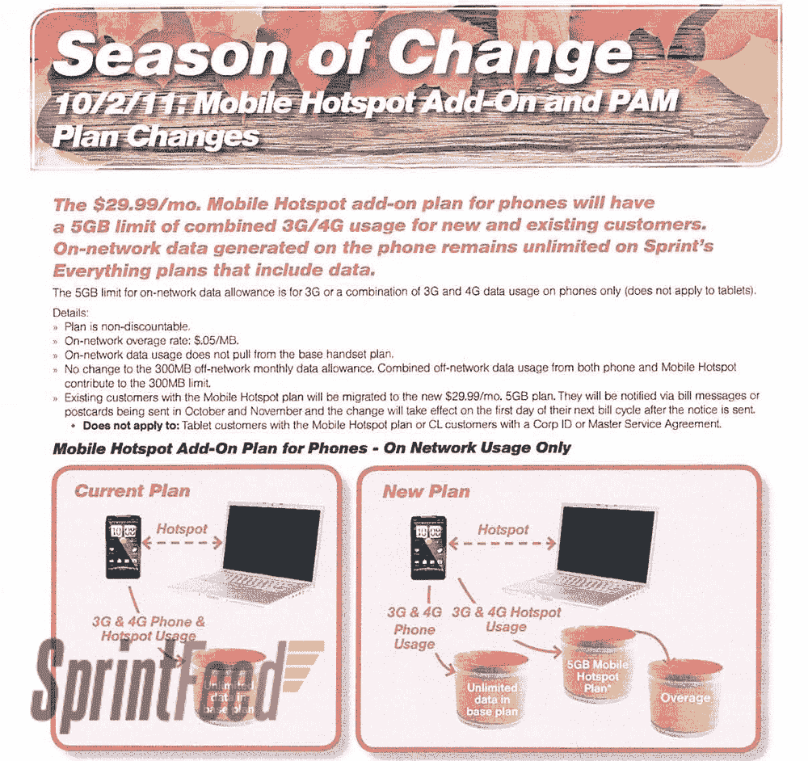

# 10 月 2 日冲刺无限热点数据封顶？TechCrunch

> 原文：<https://web.archive.org/web/https://techcrunch.com/2011/09/22/sprint-to-cap-unlimited-hotspot-data-on-october-2/>

# 10 月 2 日冲刺无限热点数据封顶？

有传言称，iPhone 5 将在未来几周(T1)开始冲刺。在此之前，Sprint 实施了一些大幅度的削减/提价，包括[提高提前终止费](https://web.archive.org/web/20230204205306/https://techcrunch.com/2011/08/31/is-sprints-early-termination-fee-jumping-to-350/)和停止 Sprint Premier。

但有一点保持不变，根据 Sprint 的说法，通过 iPhone 的推出，这一点将保持不变:无限数据。当然，除非数据是通过移动热点数据计划传输的，在这种情况下，无限不再是一个选项。

根据 [Sprint Feed](https://web.archive.org/web/20230204205306/http://www.sprintfeed.com/2011/09/sprint-capping-phone-as-a-modem-to-5gb-starting-october-2nd/) 泄露的消息，good ol’yellow 将在 10 月 2 日为他们的移动热点计划增加 5GB 的上限，超额费用为 5 美分/MB。好消息是，这个上限只影响 30 美元/月的移动热点数据计划，因此您可以安全地享受定期无限数据。但是你应该尽你所能充分利用它——没有人知道 Sprint 能在 iPhone 上保持无限的数据多长时间。

威瑞森拥有全国最强大的网络之一，当 iPhone 攻击他们的网络时，他们无法遵守关于无限数据的承诺。Sprint 要小得多，虽然无限数据基本上是他们用来吸引人们远离大公司的胡萝卜，但这将更加难以维持。

查看下面的图片，一窥泄露的文件。

