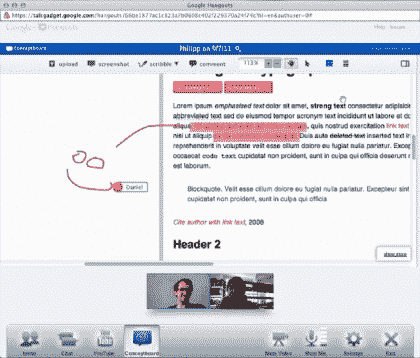

# Conceptboard 首次为 Google+ Hangouts 推出更好的白板 TechCrunch

> 原文：<https://web.archive.org/web/http://techcrunch.com/2011/09/23/conceptboard-debuts-better-whiteboarding-for-google-hangouts/>

# Conceptboard 首次为 Google+ Hangouts 推出更好的白板

虽然距官方 Google+ Hangouts API (应用程序编程接口)的发布只有几天时间，但我们已经开始看到一些有趣的实现首次亮相。例证:在线白板服务 [Conceptboard](https://web.archive.org/web/20230205042230/http://conceptboard.com/) 推出了 [Hangouts 扩展](https://web.archive.org/web/20230205042230/https://chrome.google.com/webstore/detail/lklieeaongcaklpejdodbkcmbdfpdabj)，让谷歌自己新集成的画板相形见绌。

周三，谷歌推出了 9 项新的 Google+功能，包括 Google+ Hangouts 的几个“额外功能”，这是社交网络的多人视频聊天组件。现在处于测试阶段，这些功能允许 Hangouts 用户在 Google Docs 上一起工作，共享屏幕或在 Sketchpad(一个简单的共享草图应用程序)上一起合作。

Hangouts 中的 Google Sketchpad 允许用户在一个基本的空白文档中绘制、添加形状、文本、线条、图像等，该文档可以保存到 Google Docs 中。

然而，Conceptboard 的 Hangouts 扩展提供了更加丰富的共享白板实现。本质上，该公司刚刚将其当前的在线白板服务打包到 Hangouts 中，允许用户徒手涂鸦，使用绘图工具，导入其他文件(包括图像、pdf、Office 文档)，写笔记，创建任务和截图，并与其他人共享他们的屏幕区域和光标(即演示模式)。

当 Conceptboard 网站上的 Hangout 结束时，那些创建免费帐户并通过唯一 URL 的人也可以使用这些板。

最重要的是，没有安装扩展、Google+帐户或 Chrome 浏览器的其他人也可以访问这些板。非 Google+用户可以使用 Conceptboard 的在线服务与其他人合作。

Google+的 Hangouts API 仍在测试中，因此 [Conceptboard 的 Chrome 扩展](https://web.archive.org/web/20230205042230/https://chrome.google.com/webstore/detail/lklieeaongcaklpejdodbkcmbdfpdabj)目前还是一个“技术预览”。可能会有 bug，但是如果挂机了，可以联系公司的支持团队[这里](https://web.archive.org/web/20230205042230/https://conceptboard.com/__/support)。扩展本身可以在 Chrome 网上商店免费获得[。](https://web.archive.org/web/20230205042230/https://chrome.google.com/webstore/detail/lklieeaongcaklpejdodbkcmbdfpdabj)

[YouTube http://www.youtube.com/watch?v=vJGp2_cXmRg]