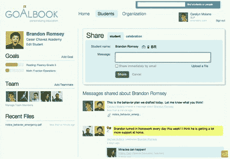
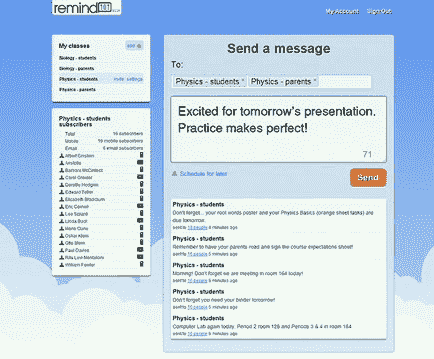
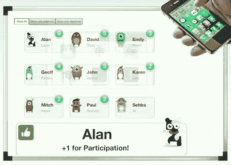

# 想象一下 K12 的 2011 年启动班旨在用技术振兴教育 TechCrunch

> 原文：<https://web.archive.org/web/http://techcrunch.com/2011/09/23/imagine-k12s-2011-startup-class-aims-to-invigorate-education-with-technology/>

[TC _ speaker text _ off]Disrupt SF 中我最喜欢的一个片段是 Imagine K12 的一组快速演示，这是一个教育相关创业公司的孵化器。我们在 6 月份听说，大约 200 名申请人已经被缩小到 10 家公司，这 10 家公司在 Disrupt 的观众面前做了简短的介绍。我们当时不能把它们写下来，所以这里有一个这些有趣的新公司和服务的迟来的纲要。

我敦促我们的读者观看视频或至少浏览我们的总结和评估。创业公司很少直接解决这样的社会问题，这些服务中的一个可能会真正让你或你的孩子受益。

我会按照他们演讲的顺序来讲解，我会给出每个演讲的时间码，这样你可以直接跳到他们。

**(4:33)**goal book 解决了小组教学和个人学习之间的脱节问题，它希望为每个学生制定一个单一的、共享的学习计划。在他们看来，家长教师会议和辅导员会议这种替代方式已经完全过时，简单的社交网络工具可以显著改善这种情况。每一个学生都是教育者、管理者和家长网络中的一个节点，而不是某个地方柜子里的一个文件和一些记在考勤表或课堂作业上的笔记。目标、策略等数据库将用于创建一个推荐引擎来帮助学生。他们在许多湾区的地区和私立学校开展。

对我来说，问题是老师们是否真的有时间或意愿去做更多的事情，而不仅仅是在布置或不布置家庭作业时，在做或不做时，等等。丰富的数据是一件好事，但必须有人来创造，而老师们已经没有时间了。

**(7:45)** 教师培训是一个昂贵且非常必要的过程，但仍停留在过去，只有基于纸张的跟踪和反馈，以及不定期的目标和建议。形成性学习希望将所有这些教师培训放在一个地方，在那里一切都以普遍理解的方式进行，并且数据被用来推荐课程、视频等等以改进教学。

当然，这只是培训过程的一部分，最重要的部分仍然是吸引和留住有积极性的教师。不管你对这种或那种技能的建议有多正确，实践学习和乐于助人的员工将是更关键的。当然，那是一整*其他*的问题。

老师、学生和家长之间的沟通方式有限，原因有很多。还有权威、特权等等问题。然而，有效和及时的沟通是教育的重要组成部分，在小班教学和私立学校中更容易找到。Remind101 希望为此提供一个安全有效的工具，使用一种孩子们似乎更喜欢而不是面对面交流的交流方式:短信。创始人将其描述为“教师的 Twitter”，但小心控制，使其安全和隐私。Remind101 不是让老师使用个人手机号码等等，而是充当老师、学生和学生家长之间的中间人。

老实说，我想不出这有什么缺点。它安全、简单，并且使用现有的基础设施。它可以在一天内与学校数据库集成，参与程度取决于参与者。我们在这里采访了 Remind101 的创始人[。](https://web.archive.org/web/20230205020952/https://techcrunch.com/2011/09/14/remind101-is-a-private-twitter-for-teachers/)

**(13:30)** 众包辅导，谁会想到？TutorCloud 认为，他们将成为让价值 80 亿美元的辅导市场变得更加现代和容易进入的人。他们的服务为大学生提供了一个市场，这些大学生希望找到自己的位置，给那些不太懂有机化学的年轻人或同龄人当老师。他们使用脸书连接 API 进行个性匹配以及主题和定价。所有的交流都发生在系统内部，因此个人信息仍然安全，响应更快的导师会获得更高的排名。实际辅导是通过共享白板空间的视频聊天进行的。

家教市场听起来不错，但老实说，我不认为基于视频的辅导会比现实生活中的人更有吸引力，因为现实生活中的人有很多优势。恐怕家长们更愿意支付家教的油钱，或者开车送孩子去图书馆聚会。也许随着在线协作工具变得更加丰富和被更多人接受，这将看起来更是一个可行的选择。

**(17:05)** 现在的孩子不玩卡门·桑迪戈或梅维斯·贝肯，这是一个悲剧，但他们确实喜欢在线玩游戏。为什么这些游戏不应该是有趣的、社交的、竞技的、有教育意义的呢？BrainNook 正在整合许多针对初级水平儿童的新游戏和体验，希望在提供算术、拼写等标准课程的同时也能吸引他们。孩子们的父母和老师可以从这些游戏中获得信息。

我必须承认，我有点脱离在线儿童游戏的世界。但是 BrainNook 听起来像是一个伟大的东西，可以提供给老师额外的学分。错过一次家庭作业？在数学游戏中达到第三级。想家了？登录并在虚拟教室中与您的朋友交谈。然而，他们是否真的能让游戏变得有趣还是一个有待回答的问题。孩子是善变的生物。BrainNook 需要的是个性。

**(20:09)** 学校收集了一吨的数据，只是为了符合各种法律法规:保留这许多年的辅导员记录、教师评价等。存档以防需要检查。但是所有这些年的数据，从这些数据中可以收集到一些有意义的东西或者发现一些趋势，却被放在抽屉里或者保存在不同的数据库里。很少有学校真正很好地组织这些信息，或者为教师和管理人员等人员提供访问途径。Eduvant 将所有这些数据整合到一个平台上。通过基于浏览器的快速访问，您可以将各种数据和分析放在一个地方。也有创建新数据的工具——咨询推荐等。

同样，我的问题是，产生这些数据可能是教师和系统中的其他人无法处理的更多工作。他们展示的主要仪表板将会很方便，但是它的实时性如何呢？谁在生成这些数据？谁在扫描纸质报告？在我看来，期待快速转换到这个在线系统是乐观的，因为它可能是有用的。但无论是 Eduvant 还是它的后代，我肯定会在几年后当这些障碍被清除时看到这样的系统出现。

**(24:20)** 教师可以使用多种服务来完成各种课堂任务，如组织测验、分配作业和资源以及在线接收家庭作业。不幸的是，它们缺乏连通性，并且一个有用的工具可能无法与另一个工具通信，或者这可能需要教师做额外的工作。ClassConnect 希望提供一个通用的软件包，让教师可以创建讲座，测试和评估学生，以及管理课堂内容。他们还制作了丰富的讲座演示工具，让学生与内容互动。

这里的问题是，它要求学生和老师都有一定程度的悟性。没有动力的学生会选择阻力最小的道路，而这可能是旧的工具:纸、铅笔和借口。贫困儿童和地区将被排除在外，所以很难让它成为一个标准工具。也就是说，课堂数据的轻松创建和共享可以节省教师宝贵的时间，让他们有更多的时间进行非常重要的面对面交流。

**(27:47)** 丰富教育媒体的制作和分发是 Educreations 认为即将爆发的一个领域，但有效制作内容所需的工具却相互脱节，而且不是针对初学者的。他们已经创建了一个简单的在线服务，在这里你可以绘制、输入和引入外部内容，这些内容可以在一个地方自动编码和共享。这就像一个开放的可汗学院。

我毫不怀疑该公司有能力交付他们所描述的东西，但它真的那么有价值吗？这种形式的视觉辅助(本质上是白板记录)可能与教师正在演示的内容匹配，也可能不匹配。我觉得他们把马车拴在了最近的星星上，而没有向前看得足够远。还有，用鼠标写字很烂。

**(30:55)**11 Learning 的创始人说，价值 130 亿美元的教科书行业是时候颠覆了。现有的在单个大卷上工作数年的系统是低效和昂贵的。他们搭建了一个平台，作者可以在这个平台上以最低的成本创作、编辑和出版教科书。

如果我没弄错的话，这整个创业公司本质上是把作者和教授的贡献价值化为零。一些教授可能会同意贡献一些时间来编辑教科书，但 40 或 50 名过度劳累的教授、文字编辑和艺术家真的会继续放弃他们的工作，并承诺以后分享一些 rev 吗？11 Learning 的 5000 美元“固定成本”数字是没有意义的。制作高质量的内容既费时又费钱，因为创建这些内容的人珍惜他们的时间。此外，许多主题根本不适合“众包”编辑和内容创作。教学的发展方向是，无论如何，集中内容已经过时了。这就像在汽车即将首次亮相时，对蒸汽机生产线进行改进一样。

**(33:55)** 管理学生行为是我们学校系统的一个主要问题，浪费了大量的上课时间，尤其是新老师的注意力。在 ClassDojo 中，课堂上的学生通过网络或智能手机应用程序公开获得积分和徽章，这些数据(+1 用于回答，-1 用于传递笔记)会被自动跟踪并与家长共享。

从这个家伙说“我们正在制作修复课堂上不良行为的软件”的那一刻起，我就持怀疑态度。当他说它“实时改善行为”时，我的闹钟响了。这只是网络应用程序中的金星贴纸。这是一个巨大的过度承诺，依赖于太多的假设，忽视了不良行为的现实。如果学生表现不佳是因为他们不尊重老师或不珍惜他们在学校的时间，这不是一个简单的虚拟分数系统可以解决的问题——它将被大多数学生忽视或讨厌。真正的行为问题和真正的行为管理需要时间和工作。这是没有办法的，尤其是没有像这样脆弱的东西。

* * *

对许多这类初创公司的考验是，它们是否能撑过试验阶段，而所有这些公司显然都处于试验阶段。他们看到的巨大数字就像是任何新服务的初始冲击。你听说过它(在这种情况下，想象一下 K12 确实定位了本地区域)，你尝试了一下，然后，有机地，你要么继续使用它，要么停止使用它。

一些我可以看到真正回升。Remind101、Eduvant 和 ClassConnect 我很有可能被选中，如果一开始只是他们所做工作的一小部分。我认为，当面对非理论使用场景时，其中一些可能会被迫折叠或转向。当然，每个老师和学校都是不同的，有不同的要求，所以支持将是一项全职工作。

此外，我承认这是年轻创业公司的一个行业问题，但这将有助于他们有更多的证明时间。当然，在许多地区呆几周或几个月是好的，但这些人真正需要的是挑选两到三个非常不同的教室，并在整个学年中与他们密切合作，如果做不到这一点，至少半年。他们需要的不是飙升的用户数量，这通常属于熟数字的范畴，而是真实生活的案例研究。没有校长会关心你有 10，000 个教室被你的工具跟踪。然而，当你告诉他们【T2 一号】教室极大地提高了参与度，或者显示家长参与度增加了 50%，或者诸如此类的事情时，他们会在意的。太多这样的创业公司都有这样一种印象，即开始时的动力爆发意味着他们的服务是有效的。不是真的。如果服务是有效的，那么它也是有效的，而教育不是一场短跑，而是一场持久战。

尽管我并不同意 Imagine K12 公司的第一个“班级”中所有公司的想法或执行，但我对他们正在尝试的事实表示钦佩。太多的创业文化关注前沿消费，完全忽略了一些领域，在这些领域，即使是我们认为理所当然的技术的最小应用也可以显著改善教育、社会服务等条件。我期待下一代的 Imagine K12 创业公司。