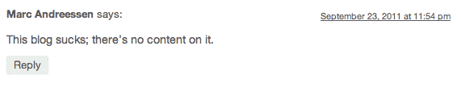

# TechCrunch 创始人迈克尔·阿灵顿推出新博客 Uncrunched

> 原文：<https://web.archive.org/web/https://techcrunch.com/2011/09/23/techcrunch-founder-michael-arrington-launches-a-new-blog-uncrunched/>

# TechCrunch 创始人迈克尔·阿灵顿推出新博客 Uncrunched

TechCrunch 创始人[迈克尔·阿灵顿](https://web.archive.org/web/20230205014752/http://www.crunchbase.com/person/michael-arrington)，最近[离开了他六年前创立的公司](https://web.archive.org/web/20230205014752/https://techcrunch.com/2011/09/12/deciding-to-move-on/)，现在又回来了。或者至少，他已经证明了他仍然知道如何建立一个 WordPress 博客。

阿林顿刚刚在推特上发布了一个链接，链接到了[未发布的](https://web.archive.org/web/20230205014752/http://www.uncrunched.com/)，从现在开始，这将是他的个人博客。除了他的第一篇[帖子](https://web.archive.org/web/20230205014752/http://uncrunched.com/2011/09/23/here-i-am/)标题为“*我在这里”*之外，还没有太多东西。仅此而已——这篇文章只包含标题——但想必他以后的文章内容会多一点(祈祷克朗彻基金普通合伙人的新角色只是一个挖掘硅谷所有黑暗秘密的策略)。

这就引出了评论。

阿林顿显然已经决定使用基本的 WordPress 评论系统。这是一个勇敢的举动(你可能还记得以前 TechCrunch 的评论)，但巨魔还没有淹没博客。

按照由来已久的互联网传统，博客上的第一条评论是“omg”。第一。”——祝贺前 TC 开发者和 Cake Health 联合创始人[安迪·布雷特](https://web.archive.org/web/20230205014752/http://twitter.com/andrewpbrett)夺得冠军。菲利普·卡普兰(Philip Kaplan)的努力获得了“A”，尽管他是博客的第 12 条评论，但他写了“第一条”。其余的评论通常是积极的，尽管有一些异常值，如下面嵌入的一个。

*披露:阿林顿曾是我的老板很长一段时间，当 TC 还在他家之外的时候，我吃了很多他的麦片。*