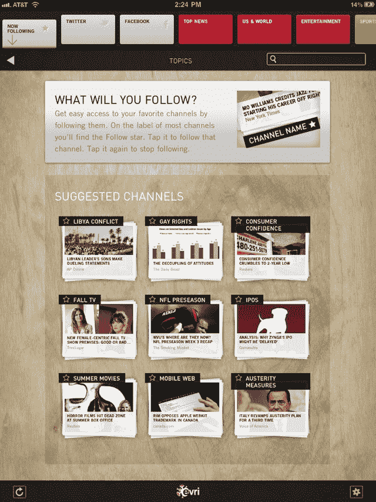

# Evri 在 iPad 上推出了新的基于主题的新闻阅读器 TechCrunch

> 原文：<https://web.archive.org/web/https://techcrunch.com/2011/09/26/evri-comes-to-ipad-with-new-topic-based-news-reader/>

实时语义初创公司 [Evri](https://web.archive.org/web/20221127183510/http://www.evri.com/) 今天首次推出其全新的 [iPad 应用程序](https://web.archive.org/web/20221127183510/http://corporate.evri.com/ipad/)，它加入了拥挤的“iPad 新闻杂志”空间，其中充满了像 [Flipboard](https://web.archive.org/web/20221127183510/http://www.crunchbase.com/company/flipboard) 、 [The Daily](https://web.archive.org/web/20221127183510/http://www.crunchbase.com/company/the-daily) 、 [Zite](https://web.archive.org/web/20221127183510/http://www.crunchbase.com/company/zite) 、 [Pulse](https://web.archive.org/web/20221127183510/http://www.crunchbase.com/company/pulse) 、 [NewsMix](https://web.archive.org/web/20221127183510/http://www.sobees.com/) 、 [AOL Editions](https://web.archive.org/web/20221127183510/https://beta.techcrunch.com/2011/08/02/aol-editions-ipad/) 、 [News360](https://web.archive.org/web/20221127183510/http://www.crunchbase.com/company/news360) 等。为了与众不同，Evri 的应用程序结合了社会新闻和话题流，允许读者关注他们的兴趣，而不仅仅是关注消息来源。

这款新应用严重依赖 Evri 的语义基础，将非结构化数据转化为基于主题的渠道。该公司的内容发现引擎分析来自 15，000 个新闻源的提要，通过其自然语言处理(NLP)解析器运行数据，并提取实体，将其放入 Evri 的语义索引中。此外，该引擎还根据某个主题被报道的次数、报道速度、在 Twitter 或脸书上被分享的频率等因素来确定哪些新闻是热门新闻。

与新闻集团的《每日新闻》等应用不同，Evri 的索引每 15 分钟更新一次，而不是……嗯，你知道，每日更新一次。

换句话说，Evri 已经拥有了一项相当强大的后端技术，毫无疑问，去年[收购](https://web.archive.org/web/20221127183510/https://beta.techcrunch.com/2010/03/11/evri-acquires-radar-networks/)另一家语义搜索初创公司 [Radar Networks](https://web.archive.org/web/20221127183510/http://www.crunchbase.com/company/radar-networks) 在一定程度上对此有所帮助。但更重要的是，至少对消费者来说，新应用的界面。鉴于 Evri 在设计方面并不总是领先，这是一个问题。(有人记得 Evri 的亮粉色“顶级八卦”手机 app 吗？[我做](https://web.archive.org/web/20221127183510/http://www.readwriteweb.com/archives/semantic_startup_evri_goes_mobile.php)。*颤栗*。)

事实证明， [Evri iPad 应用程序](https://web.archive.org/web/20221127183510/http://corporate.evri.com/ipad/)是美容部门的一大进步。用户界面从[脉冲](https://web.archive.org/web/20221127183510/http://itunes.apple.com/us/app/pulse-news-for-ipad/id371088673?mt=8)中获得了一些灵感，因为它还具有被黑白文本覆盖的图像缩略图。然而，Evri 在主题导航方面有自己独特的见解。

屏幕顶部是代表主要类别的亮色方块，包括热门新闻、美国与世界、娱乐、体育、商业和技术。前面有三个灰色按钮，分别代表社交新闻(推特和脸书)和“现在关注”，这部分专门列出了你个人最喜欢的话题。

点击这些主要类别中的任何一个，查看这些区域内的趋势新闻，或者使用旁边的导航工具深入研究子类别(也可以是图像缩略图，但较小)。)这听起来像是很多导航选项，但它做得很好，没有压倒性优势，当您需要它时，它会消失。

然而，当你深入到各个部分时，你会发现只有文章片段，而不是像 Flipboard 这样的应用程序提供的精简的、干净的文本。Evri 决心变得更“对出版商友好”，使用应用程序内的浏览器将用户发送到实际的网站，包括共享按钮和支持 Instapaper 和 read later 的“以后阅读”选项。不幸的是，对读者来说，这并不像 iPad 优化的 Flipboard 那样令人愉快，坦白地说，Flipboard 仍然是这个领域需要击败的应用。

在测试中，Evri 的应用程序偶尔会变慢并崩溃几次，但我使用的版本仍在开发中。希望到今天发布的时候，那些臭虫已经被压扁了。当该应用程序运行时，很容易浏览页面、搜索喜爱的话题、共享、保存和阅读文章。

[Evri for iPad](https://web.archive.org/web/20221127183510/http://corporate.evri.com/ipad/) 是通过 iTunes 免费下载的。未来，它可能会包括用于赚钱的应用内广告，但该公司尚未对这些细节进行分类。首席执行官威尔·亨辛格说，Evri 首先需要进入游戏。就像他们说的，亨辛格开玩笑说，“如果你不在球场上，你就不能进入比赛。”

 