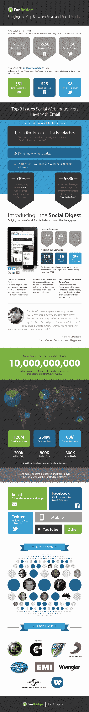

# 粉丝管理平台 FanBridge 为品牌发布电子邮件摘要，以管理流行的社交内容 TechCrunch

> 原文：<https://web.archive.org/web/http://techcrunch.com/2011/09/26/fan-management-platform-fanbridge-launches-email-digest-for-brands-to-curate-popular-social-content/?utm_source=dlvr.it&utm_medium=twitter>

# 粉丝管理平台 FanBridge 为品牌发布电子邮件摘要，以管理流行的社交内容

粉丝“关系管理”服务 [FanBridge](https://web.archive.org/web/20230205024059/http://www.fanbridge.com/) 今天推出了一项新功能，名为“社交文摘”，为有影响力的人和品牌提供了一种与粉丝和追随者保持联系的方式。《社交摘要》每周自动将最受欢迎的社交内容整理成电子邮件摘要分发给粉丝。

FanBridge，已经[从 SoftTech VC、Lowercase Capital、500 Startups、First Round Capital、Founder Collective、Grape Arbor VC、Alex Zubillaga 募集资金](https://web.archive.org/web/20230205024059/https://techcrunch.com/2011/01/18/2-million-fanbridge-damntheradio/)；通过选择加入电子邮件和复杂的分析，帮助乐队、艺术家、运动队，甚至小企业和品牌管理他们的粉丝群。它仅通过电子邮件就管理着超过 1.2 亿的粉丝。

利用 FanBridge 平台的基础，分析超过 1.2 亿电子邮件订户、2.5 亿脸书粉丝和 8000 万推特粉丝的行为，Social Digest 自动提取每个品牌最受欢迎的内容。客户只需要从他们的 FanBridge 帐户同步他们的社交网络，Social Digest 将确保订阅者每周都能看到最“粘性”的内容。

7 月，FanBridge 与精选客户一起启动了《社交文摘》的私人测试版。电子邮件的平均打开率为 30%(相比之下，一般活动的平均打开率为 15%)，社交内容的平均点击率为 18%(相比之下，一般活动的平均点击率为 6%)，广告/赞助商内容的平均点击率为 3%(相比之下，一般活动的平均点击率为 1%)。

