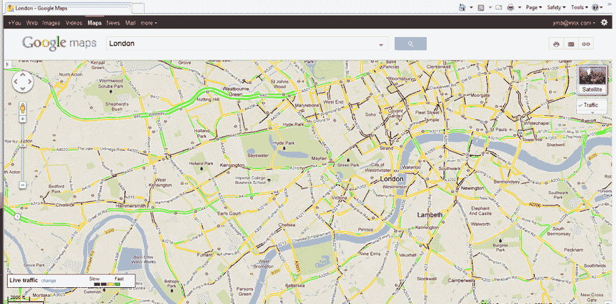

# 谷歌利用凯鹏华盈支持的 Inrix 为地图和导航应用提供实时交通数据 TechCrunch

> 原文：<https://web.archive.org/web/http://techcrunch.com/2011/09/26/google-taps-kleiner-backed-inrix-to-provide-real-time-traffic-data-for-maps-and-navigation-apps/?utm_source=dlvr.it&utm_medium=twitter>

# 谷歌利用凯鹏华盈支持的 Inrix 为地图和导航应用提供实时交通数据

谷歌选择实时汽车交通数据公司 Inrix 提供交通数据，以帮助这个搜索巨头的导航和地图应用。

Inrix 刚刚[从凯鹏华盈(Kleiner Perkins)和奥古斯特资本(August Capital)筹集了 3700 万美元](https://web.archive.org/web/20230204193846/https://techcrunch.com/2011/07/24/kleiner-perkins-leads-37-million-round-in-realtime-traffic-data-company-inrix/)，它聚合和众包了来自 3000 多万个来源的实时交通信息，包括汽车、出租车、送货车、卡车和其他渠道，Inrix 的数据软件聚合和增强了来自数百个公共和私人来源的交通相关信息，然后将这些数据出售给移动应用程序开发者和网站。

目前，该公司提供北美和欧洲 22 个国家的数据，用户超过 1 亿。Inrix 的其他合作伙伴包括奥迪公司、ADAC、ALK、ANWB、Coyote、福特汽车公司、I-95 联盟、MapQuest、微软、NAVIGON、Tele Atlas、Telmap、TeleNav、德克萨斯运输协会和丰田。在一项正在进行的全球交通信息独立测试中，马里兰大学发现 Inrix 的实时交通信息在 90%以上的时间里与实际交通速度的误差在 5 英里/小时以内。

Inrix 表示，其融合引擎和 API 的灵活性和架构使合作伙伴能够轻松集成数据。有了 Google，Inrix 从签约到实施只用了不到 45 天。Inrix 最初在 8 个国家提供，所有主要高速公路的实时交通信息将与谷歌在线和手机产品和服务集成。

谷歌的交易无疑是 Inrix 的一大胜利。谷歌地图无疑是谷歌最受欢迎的产品之一，合作关系(如果进展顺利)应该会大大增加这家凯鹏华盈支持的公司的收入。然而，这笔交易并不是排他性的。谷歌将从其他来源获得一些流量数据。

谷歌发言人发表声明:*谷歌致力于为我们的用户提供最丰富、最新的地图，包括实时交通更新。谷歌地图上的交通数据来自各种来源，包括政府交通部门、私人数据提供商以及通过我们的交通众包功能提供匿名速度信息的谷歌地图移动版用户。*

