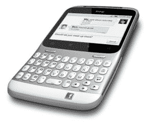

# HTC“脸书手机”转投中国市场

> 原文：<https://web.archive.org/web/http://techcrunch.com/2011/09/26/htc-facebook-phone-dumps-facebook-for-chinese-market/>

# HTC“脸书手机”转投中国市场

如何在没有脸书的环境下销售脸书手机？对 HTC 来说幸运的是，中国并不缺少本土社交网络，其中最大的社交网络之一是即时通讯服务 QQ。因此，随着 HTC Status(曾被称为 ChaCha)向我们最喜爱的社交网络被禁的中国迁移，脸书将被留下来为专用的 QQ 按钮腾出空间(见左图)。

现在，这款手机仍将被称为 ChaCha，据 MicGadget 报道，除了默认的社交服务被调换之外，它将与 T2 的 AT T7 T 版本 T3 没有任何区别。为了唤起你的记忆，Status/ChaCha 配备了一个 2.6 英寸的 HVGA 显示屏，下面是一个完整的 QWERTY 键盘，黑莓风格。它在 800MHz 处理器上运行 Android 2.3 姜饼，配有 500 万像素的后置摄像头和 HTC Sense 3.0 UI。

 它真正突出的特点是手机右下角的专用脸书按钮。它可以让你即时访问社交网络，当你在一个可共享的页面，视频等时，它会发出脉冲。按下后，无论你在看什么网页，听什么歌，都会自动上传到你的脸书墙上。显然，这个按钮在 QQ 及其 7 亿多用户上的工作方式会有所不同，但同样的想法仍然适用。

HTC 还不太清楚中国 ChaCha 的供货情况，但我们知道它的售价为 2680 元，在美国是 419 美元。