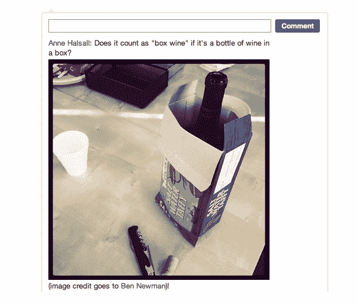

# Quora 获得线程评论、评论投票、编辑和图片

> 原文：<https://web.archive.org/web/http://techcrunch.com/2011/09/26/quora-gets-threaded-comments-comment-voting-editing-and-images/>

# Quora 获得线程评论、评论投票、编辑和图片

问答网站 [Quora](https://web.archive.org/web/20230326023541/http://www.quora.com/) 刚刚向[公布了其评论系统的改进](https://web.archive.org/web/20230326023541/http://www.quora.com/Shu-Uesugi/The-New-Quora-Comments)，最显著的变化是为问题下的讨论及其后续回答实现了线程评论功能。新的线索评论允许用户通过在每个评论下的回复框中输入文本来直观地回复回答线索中的特定评论。

此外，Quora 现在允许用户通过点击向上箭头和向下箭头来对评论的有用性或有效性进行投票，就像他们对有用/无用的答案进行投票一样。好像这还不够(！)，Quora 用户现在也可以在评论中嵌入图片，并就地编辑评论。撇开讽刺的感叹号不谈，这个剪辑其实很酷，嗯，脸书。

和脸书评论一样，Quora 评论要求用户使用真实账户登录才能参与讨论。希望匿名提问的人不能对答案发表评论，如果你用真实账户提问，然后切换到匿名设置，你将失去评论。

到目前为止，我询问的用户对新评论的反应褒贬不一，一些人说这个特性是积极的，减少了评论线程中的噪音，另一些人认为嵌套的评论用户界面有点让人受不了。“该功能的设计是…嗯，嗯，这有点可怕，”[写道](https://web.archive.org/web/20230326023541/http://www.quora.com/Yishan-Wong/Yay-for-Up-Downvotes-on-Comments)有影响力的用户 Yishan Wong“但我不太关心；我相信会解决的。”

Quora power 用户 Semil Shah 希望这一功能是未来 Quora 扩张的一个标志，“理论上,‘Quora 评论’功能可以遍布数字媒体和内容网站，并为脸书的社交插件提供一个有趣的替代方案，主要是因为 Quora 确实可以验证身份，但也允许匿名。”

Quora 的马克·博德尼克(Mark Bodnick)着眼于现在，“我们看到的是，人们喜欢谈论和讨论帖子和问题，这让他们以一种更有组织性、更有趣和更积极的方式来做这件事。”

