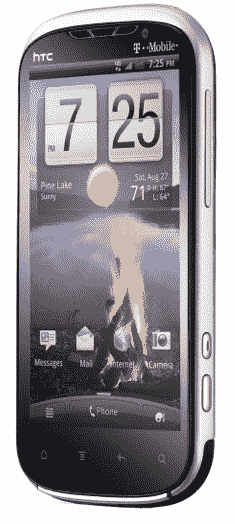
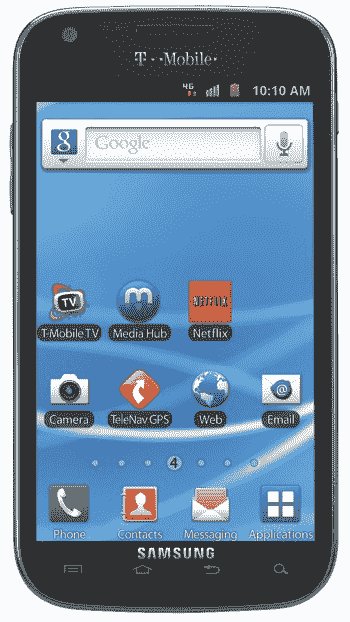

# T-Mobile 正式推出两款新手机:HTC Amaze 4G 和三星 Galaxy SII TechCrunch

> 原文：<https://web.archive.org/web/http://techcrunch.com/2011/09/26/t-mobile-galaxy-s2-amaze-4g-specs/>

# T-Mobile 正式推出两款新手机:HTC Amaze 4G 和三星 Galaxy SII

你可以给 T-Mobile 起很多名字，但“保守秘密很棒”可能不在其中。

今天早上，在 GigaOm 的移动会议上，T-Mobile 宣布了两款手机的细节:HTC Amaze 4G(几周前被彻底泄露)和他们的三星 Galaxy S2 版本(上个月在 T2 宣布，但没有详细说明)。)

首先，HTC Amaze 4G 规格:

*   安卓 2.3.4
*   1.5 Ghz 双核 CPU
*   4.3 英寸 qHD (960×540)显示屏
*   1GB 内存
*   800 万像素后置摄像头(带双 LED 闪光灯和 1080p 视频录制)
*   200 万像素前置摄像头
*   802.11b/g/n WiFi

接下来，该公司终于咳出了(一些)关于他们的银河 S2 变种的货物。到目前为止，T-Mobile 对这款设备一直表现出奇怪的非常秘密的风格；在三星的美国 SII 发布会上，他们把它关在一个大玻璃盒子里(而 Sprint 和美国电话电报公司很快就展示了他们的产品)，任何关于里面有什么的问题都得到了含糊的“我们稍后会有更多消息”的回应。

以下是他们为 T-Mobile 的银河 SII 透露的消息:

*   安卓 2.3.5
*   1.5 Ghz 高通 S3 双核 CPU
*   支持 NFC
*   4.52 英寸 Super AMOLED Plus 显示屏

这证实了之前的传言，T-Mobile 的 SII 将运行在 1.5 Ghz 的高通芯片组上，而不是美国电话电报公司和 Sprint 型号中的 1.2 Ghz 三星制造的芯片组。

另外值得注意的是:这两款手机将首次运行在 T-Mobile 的 42 兆比特每秒的 HSPA+ 42 网络上。

两款手机都将于 10 月 12 日上架，Amaze 4G 在两年合约和 50 美元邮寄折扣后将花费你 259.99 美元，而 SII 在相同条件下将花费 229.99 美元。对于任何关注此事的人来说:那是在传闻苹果将于[宣布下一代 iPhone](https://web.archive.org/web/20230203071909/https://techcrunch.com/2011/09/21/report-next-apple-media-event-october-4th-to-star-tim-cook-and-the-iphone-5/) 的一周之后……如果历史可以借鉴的话，这些设备和 iPhone 5 很可能会在同一周发布。那应该……有意思？