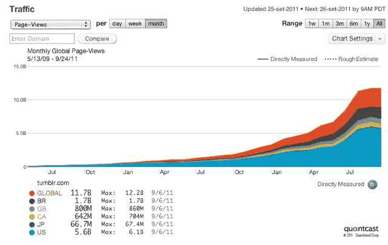

# Tumblr 是一个页面浏览量机器，现在比维基百科 TechCrunch 还大

> 原文：<https://web.archive.org/web/https://techcrunch.com/2011/09/26/tumblr-pageview-machine-bigger-than-wikipedia/>

# Tumblr 是一个页面浏览量机器，现在比维基百科还大

如果你想知道为什么 Tumblr 刚刚筹集了 8500 万美元，你所要做的就是看看它的浏览量。自今年年初以来，这个超级简单的博客平台的浏览量从每月 20 亿次跃升至 130 亿次。它最近通过了[100 亿个帖子](https://web.archive.org/web/20230207014729/https://techcrunch.com/2011/09/09/tumblr-10-billion/)，并且每天增加 4000 万个。根据直接测量该网站的 [Quantcast](https://web.archive.org/web/20230207014729/http://www.quantcast.com/tumblr.com) ，Tumblr 每月吸引 7200 万访问者，其中超过一半来自美国以外

但是与访问者相比，它的浏览量实在是太大了。事实上，根据 comScore 的数据，Tumblr 现在每月产生的浏览量比维基百科还多，而访客数量只有维基百科的十分之一。Tumblr 的设计方式是在成员之间产生大量的内部流量。投资者 Bijan Sabet 最近[指出](https://web.archive.org/web/20230207014729/http://bijansabet.com/post/10453137070/my-duel-citizenship-on-tumblr)“登录用户驱动了绝大部分的使用&页面浏览量。”

为了了解 Tumblr 的浏览量有多异常，让我们更深入地看看 comScore 的数据。(ComScore 的估计低于 Quantcasts，但显示了相同的总体趋势)。今年 8 月，Tumblr 进入了 comScore 追踪的前 100 个网站(排在第 99 位)，估计有 4100 万独立访问者。但据估计，每月 65 亿的浏览量使其在所有网站中排名第 21 位。相比之下，维基媒体基金会网站(包括 Wikipedia.org)每月有 4.23 亿独立访客，产生 56 亿次页面浏览量。

Tumblr 的页面浏览量也比 Twitter.com 大(但不是独立访问者)，大约是 AOL 和 Craigslist 的一半。以下是 Tumblr 与 ComScore Top 100 中其他精选网站相比的页面浏览量排名:

> 1.脸书(503 亿 PVs/月)
> 2。谷歌(272B PVs 月)
> 。
> 。
> 。
> 13。craigslist(12.5 亿 PVs/月)
> 14。美国在线(12.4 亿 PVs/月)
> 。
> 。
> 。
> 21。Tumblr(6.5 亿 PVs/月)
> 22。维基媒体基金会网站(每月 5.6 亿 PVs)
> 。
> 。
> 。28。CBS 互动(4.1 亿 PVs/月)
> 。
> 。
> 。32。Twitter(3.4 亿 PV/月)
> 33。ESPN(每月 33 亿 PV)

