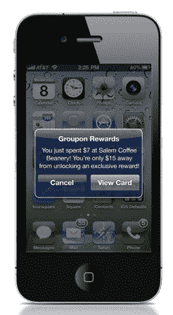
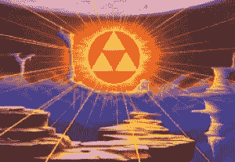

# Groupon 以忠诚度奖励结束兑换循环 TechCrunch

> 原文：<https://web.archive.org/web/http://techcrunch.com/2011/09/27/groupon-loyalty-rewards/?utm_source=feedburner&utm_medium=feed&utm_campaign=Feed%3A+Techcrunch+(TechCrunch>)

Groupon 可能正在艰难地进行首次公开募股，但这并没有阻止它推出新产品。到目前为止，Groupon 已经通过让当地商家向消费者提供优惠的一次性交易，建立了价值 10 亿美元的业务。这些日常交易都是为了吸引新客户。现在，该公司即将推出一款名为 Groupon Rewards 的新产品，试图为商家提供一种提高客户忠诚度的方法。商家明天就可以开始签约，消费者将在 10 月份开始看到回报。

有了 Groupon 奖励，提供常规 Groupon 交易的企业将能够在客户消费一定金额后获得另一项奖励。例如，顾客在商店消费 50 或 100 美元一段时间后，她可能会以 4 美元的价格获得价值 20 美元的商品。

这都与人们每天使用的信用卡有关，因此没有必要改变行为。不需要签到，也不需要 [NFC 手机钱包](https://web.archive.org/web/20230204190857/https://techcrunch.com/2011/09/19/techcrunch-review-google-wallet/)在陌生的新终端上挥舞。Groupon 已经有数百万张信用卡存档。现在，它将把这些信用卡变成你放在钱包里的咖啡店里的“买十送一”穿孔卡的数字版本。

 顾客只需使用已经在 Groupon 备案的同一张信用卡付款(选择加入该计划后)。她可以通过多次访问达到商家设定的消费目标。每次，她都会收到电子邮件或手机通知，提醒她刚刚在一家提供 Groupon 奖励的商家消费了，以及她还需要花多少钱才能解锁:“你刚刚在塞勒姆咖啡馆消费了 7 美元！距离解锁独家奖励只差 15 美元了！”

对 Groupon 来说，该产品最大的优势之一是它最终关闭了当地商业中的[兑换循环](https://web.archive.org/web/20230204190857/https://techcrunch.com/2011/07/24/redemption-loop-local-commerce/)。如今，对于 Groupon 的大多数日常交易，他们仍然不知道有多少人兑换了它们，也不知道他们何时在每个商家消费了多少。Groupon Rewards 实际上可以跟踪每个商家的支出，这让 Groupon 更好地了解其主要业务的成功(有多少购买常规 Groupon 的人回来了，他们花了多少钱，等等？).参与的商家也将获得一个仪表板来跟踪这些指标。

Groupon 已经与 Foursquare 合作，向使用该服务的人展示其交易，但听起来效果并不好。“商户合作伙伴最大的抱怨之一，”产品高级副总裁杰夫·霍尔登说，“是有大量的登记欺诈，而且它与消费无关。”换句话说，当商家提供与一定数量的签到挂钩的奖励时，人们可以在 Foursquare(或脸书)上签到，无论他们是否真的在该机构。“我不喜欢入住模式，因为它存在一些问题，”Holden 解释道。“这是一种不可避免的罪恶，因为没有一种好的方法来跟踪顾客与商家的互动。我们可以排除所有这些其他工具。我想他只是把 Foursquare 的主要功能称为“必要的邪恶”。"

 霍顿将 Groupon Rewards 定位为公司“Triforce”的一部分(没错，那是一部 [*塞尔达传说*参考](https://web.archive.org/web/20230204190857/http://zelda.wikia.com/wiki/Triforce))。“我们认为，在本地商业的新世界中，商家需要三个要素来经营他们的业务，”他解释道。第一个是每日交易，Groupon 将其完善为一种客户获取产品，并达到了巨大的规模。第二个是 Groupon Now 的移动应用程序，它让当地商家在生意清淡时通过提供交易来进行收益管理。第三个是 Groupon Rewards，它建立在顾客忠诚度和忠诚度的基础上。

后两者中的每一个，Groupon Now 和 Groupon Rewards，都是由主要的日常交易业务促成的。Groupon 利用每日交易的诱惑与数十万商家签约，现在正试图利用它们来分销其其他产品。与大多数忠诚度奖励(往往比 50%的每日交易少得多)不同，Groupon 将推动商家提供类似于每日交易的奖励折扣。但是，顾客必须自己赚钱才能达成这笔大交易，商家也能够设定达到目的所需的消费水平。然而，与普通的 Groupon 交易不同，商家不会保留优惠券金额的一半。如果奖励是价值 20 美元的商品的 4 美元优惠券，那么这 4 美元将全部归 Groupon 所有。一方面，试图不分割它可能是一个硬推销。另一方面，它激励商家提供更大的折扣。他们只需将奖励的总价值计入他们为交易设定的支出限额。换句话说，他们必须弄清楚忠诚客户的价值到底是什么。

Groupon 现在表示，它尚未确定商家和 Groupon 之间奖励交易的分成比例。