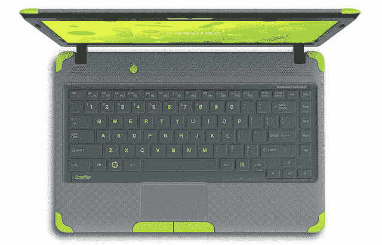

# 东芝发布最新儿童友好型笔记本电脑 TechCrunch

> 原文：<https://web.archive.org/web/https://techcrunch.com/2011/09/27/toshiba-announces-updated-kid-friendly-laptop/>

# 东芝宣布更新儿童友好型笔记本电脑

如果银色和霓虹绿色的笔记本电脑有观众的话，那就是孩子(也可能是非常喜欢酸橙绿色的人)。也就是说，东芝刚刚推出了最新的儿童友好型笔记本电脑:Satellite L735D。东芝和百思买在这一个上一起工作，并且做了相当多的研究以确保小的得到他们想要的。有很多银色和霓虹绿色。

Satellite L735D 实际上只是 L635，它采用了一些适合儿童的设计，充满了适合儿童的软件，价格更具竞争力。这是一款全 13.3 英寸的笔记本电脑，配有 1.3GHz AMD E 系列处理器和 320GB 硬盘。13.3 英寸的屏幕分辨率为 1300×708，支持 720p 视频播放。L735D 还具有两个 USB 2.0 端口，一个用于视频聊天的网络摄像头，电池续航时间为五个半小时。显然，这些规格并不令人垂涎，但考虑到这个小家伙想要的相当低的价格点，它们是有意义的。

至于以孩子为中心的功能，最明显的(除了配色方案)将是“可擦拭”键盘。东芝非常小心地没有使用“防溅”这个术语，所以不要认为你可以让小汤米带着满满一杯汽水去他的笔记本电脑。然而，一旦他完成了，把键盘弄得足够粘了，就可以随意把它擦干净了。卫星 L735D 还预装了*乐高哈利波特:视频游戏*，以及 KidZui(专为儿童设计的浏览器)。

卫星 L735D 将于 10 月初在百思买独家发售，建议零售价为 497.99 美元。