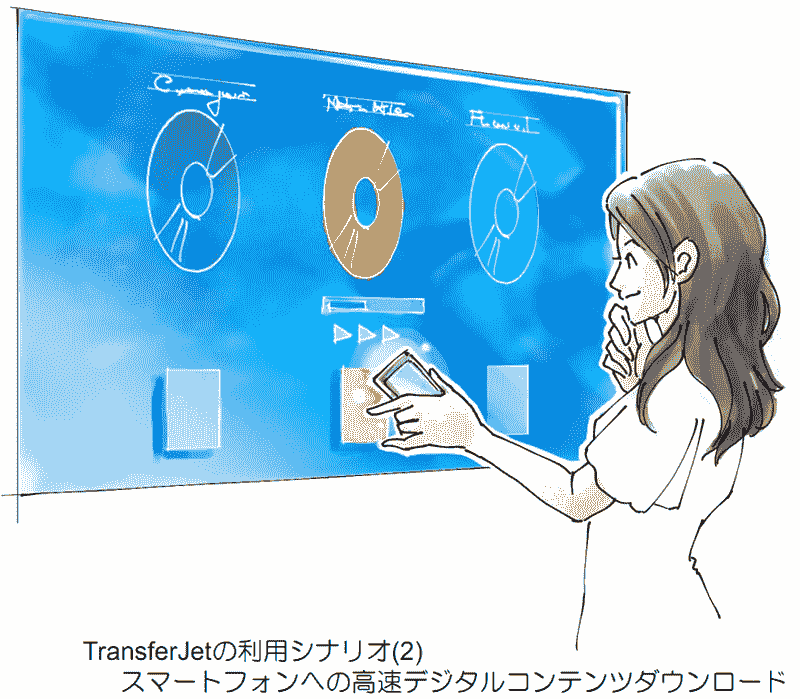

# 东芝展示 TransferJet 兼容大规模集成电路，可实现稳定的无线数据交换

> 原文：<https://web.archive.org/web/http://techcrunch.com/2011/09/27/toshiba-shows-transferjet-compatible-lsi-for-stable-wireless-data-exchange/>

# 东芝展示与 TransferJet 兼容的大规模集成电路，以实现稳定的无线数据交换

近距离技术 [TransferJet](https://web.archive.org/web/20230203145057/http://en.wikipedia.org/wiki/TransferJet) 正在发展。[东芝](https://web.archive.org/web/20230203145057/https://techcrunch.com/tag/toshiba)开发了一种支持 TransferJet 的大规模集成电路(如图)，专门为移动设备设计。东芝表示，大规模集成电路的尺寸仅为 4.0×4.0×0.5 毫米，是同类产品中最小的。

该公司表示，大规模集成电路实现了-78dBm 的接收灵敏度，超过了 TransferJet 标准本身的价值(-71dBm)，并使两个配备 TransferJet 的设备之间的数据传输更加稳定(它实际上拥有业界最高的灵敏度)。

东芝还将 TransferJet 的一个射频开关和射频电路塞进了芯片。该公司预计它将用于平板电脑、智能手机、笔记本电脑、数码相机和类似设备。

一个用例是两个人用他们的手机更容易地交换联系数据:

东芝表示，这种新芯片还可以更容易地接收来自数字白板、数字标牌显示器等的内容。：

[T2](https://web.archive.org/web/20230203145057/https://techcrunch.com/wp-content/uploads/2011/09/tc35420-3.jpg)

该公司计划于 2012 年 1 月开始运送首批样品，并于 2012 年第二季度开始每月生产 100 万枚芯片。

通过[Digikame Watch](https://web.archive.org/web/20230203145057/http://dc.watch.impress.co.jp/docs/news/20110927_479797.html)【JP】