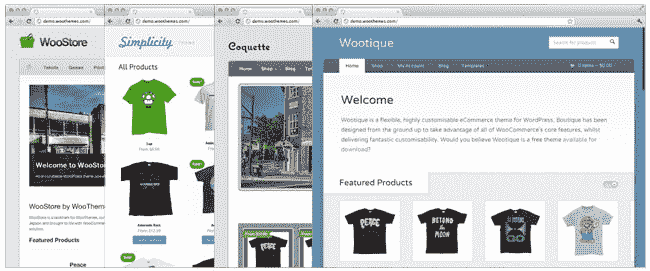
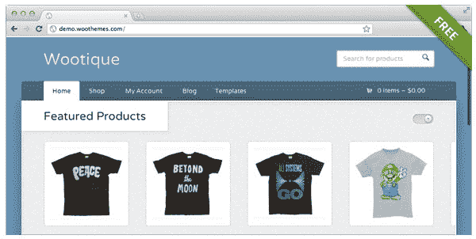
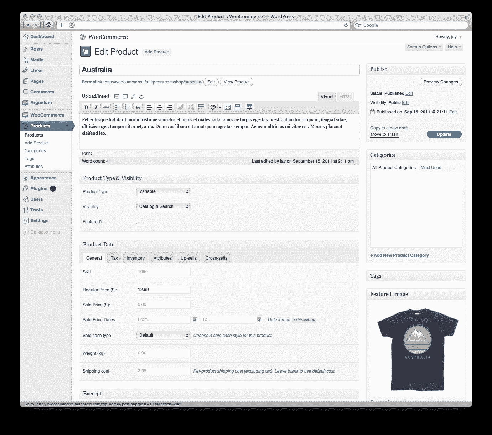

# WooThemes 推出 WooCommerce，将 WordPress 网站变成网上商店

> 原文：<https://web.archive.org/web/https://techcrunch.com/2011/09/27/woothemes-launches-woocommerce-to-turn-wordpress-sites-into-online-shops/>

WordPress 主题提供商 [WooThemes](https://web.archive.org/web/20230205044824/http://www.woothemes.com/) 今天推出了一项名为 [WooCommerce](https://web.archive.org/web/20230205044824/http://woothemes.com/woocommerce) 的新服务，允许用户在他们的 WordPress 网站上安装插件，以便将该网站变成专业的电子商务店面。该系统包括一个插件和该公司的主题库，同时还提供多种支付网关选项、配置运费的设置、优惠券支持、电子邮件模板、跟踪销售和业绩的报告面板等。

WooCommerce 插件旨在与现有的主题库一起工作，这些主题库是 [WooThemes](https://web.archive.org/web/20230205044824/http://www.woothemes.com/) 已经提供的。该公司有超过 50，000 名付费用户，他们已经下载了超过 800，000 次免费主题。它也是 WordPress.com 的优质主题提供商。

该公司现在专注于将其主题转化为功能齐全的应用程序。为此，WooThemes 将旗下公司 WooLabs 的一个部门投入到创造新方法，将主题转化为功能丰富的平台。电子商务是 WooLabs 的第一个产品。在未来，WooThemes 计划推出一个 SupportPress 主题的集成，该主题允许任何人出售高级 suppor，以及提供维基功能的主题和类似于 Basecamp、UserVoice 和 Quora 等流行网络应用的主题。

第一批与 WooCommerce 插件整合的 WooThemes 是 [Statua](https://web.archive.org/web/20230205044824/http://www.woothemes.com/2011/06/statua/) (允许摄影师在网上出售他们的照片)和 [Diner](https://web.archive.org/web/20230205044824/http://www.woothemes.com/2010/10/diner/) (整合即将到来)，后者允许餐馆接受他们网站上的外卖订单。

WooThemes 当然不是唯一的电子商务平台公司，但它希望成为一个更容易使用的平台，无论是在后端，通过简化的控制，还是在前端，通过良好的设计。

WooThemes 最大的竞争对手是流行的在线零售平台[shotify](https://web.archive.org/web/20230205044824/http://www.crunchbase.com/company/shopify)。但是，尽管 Shopify 灵活且可扩展，但它不是为 WordPress 网站设计的，而且它需要一点技术知识才能使用，该公司认为。

这次发布是在今年早些时候 WooThemes 决定将所有精力重新集中在 WordPress 的开发上之后进行的，理由是缺乏为 Drupal、EE 或 Magento 等公司构建主题的知识或热情。

WooCommerce 今天发布了。该代码是开源的，可以在[http://woothemes.com/woocommerce](https://web.archive.org/web/20230205044824/http://woothemes.com/woocommerce)找到。

