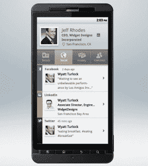

# Xobni 更名其产品 Smartr，推出 Android 和 Gmail 联系人管理器 TechCrunch

> 原文：<https://web.archive.org/web/http://techcrunch.com/2011/09/27/xobni-smartr-android/?utm_source=CampGiraffe+News&utm_medium=twitter>

# Xobni 更名其产品 Smartr，为 Android 和 Gmail 推出联系人管理器

Xobni 一直是一个聪明的名字(它的收件箱倒过来了)，但也许它太聪明了。如今，这家试图让你的电子邮件变得更智能的初创公司正在重塑其新产品 Smartr 的品牌，并推出面向安卓(Android)和 T2(Gmail)的私人测试版。

这些产品已经在 T4 进行了几个月的私下测试。Gmail 插件向你展示了从各种社交网络(脸书、Twitter、LinkedIn)和公司数据库中挑选出来的发邮件人的背景信息。它还向您显示您与该联系人的关系历史，以前的电子邮件对话和相关联系人的列表，以及联系人搜索。

Android 应用程序会接管你手机上的地址簿，并提供类似的功能。它根据重要性和你与他们交流的频率来排列联系人，而不是按字母顺序。由于全部在云中管理，它可以处理成千上万的联系人。不同的选项卡向您显示联系人详细信息、该联系人最近的社交订阅源、您的关系历史以及您共享的其他联系人。

Smartr iPhone 应用程序也在开发中。如果您购买了 Xobni Pro 帐户，您可以在 Gmail 和您的移动设备之间同步您的联系人。

