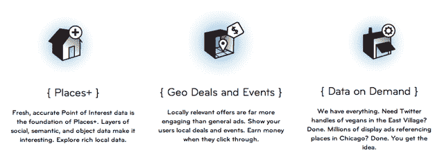

# Hyperpublic 推出免费兴趣点数据库，现在帮助开发者将本地应用货币化 TechCrunch

> 原文：<https://web.archive.org/web/http://techcrunch.com/2011/09/28/hyperpublic-launches-free-poi-database-now-helps-developers-monetize-local-apps/?utm_source=dlvr.it&utm_medium=twitter>

# Hyperpublic 推出免费兴趣点数据库，现在帮助开发者将本地应用货币化

总部位于纽约的初创公司 [Hyperpublic](https://web.archive.org/web/20230204231404/http://www.hyperpublic.com/) 今天有一些重大消息，应该会吸引那些希望与 local 合作的开发人员的眼球:他们正在开放一个名为 Places+的新兴趣点(POI)数据库的访问权限，他们还为开发人员提供了一种直接而简单的方式来开始赚钱。全部免费。

创始人[乔丹·库珀](https://web.archive.org/web/20230204231404/http://www.crunchbase.com/person/jordan-cooper)，他也是 Lerer Ventures 的风险合伙人，带我看了每一次发布。他说，Hyperpublic 以前也提供过一些位置 API，但与他们现在带来的东西相比，这些都是小土豆。

Places+产品将与 Factual 和 Foursquare 的位置数据库竞争(每个数据库都允许移动应用程序显示给定位置附近的餐馆和其他场所)。但库珀表示，Places+包含了其竞争对手数据的超集，他认为它有更新鲜的数据可以引导。

那么，Hyperpublic 从哪里获得这些数据呢？库珀表示，这项服务的方法与谷歌类似:它不断监控各种可公开访问的数据源，以确定兴趣点的位置，并查看它们是否是新的(例如，它可能会查看最近的状态更新，以查看人们是否提到了某个给定的地点，这显然表明它可能仍然存在)。在这一点上，该服务拥有超过 50 个主要城市的高密度信息。显然库珀提出了一些相当大胆的主张。时间会证明 Places+在实践中是否比其他可用的 POI 数据库更好。

下一个产品叫做地理交易和事件。这利用了这样一个事实，即在任何给定的时间，通过 Groupon、LivingSocial 等各种服务，你所在的地区都有很多本地企业在进行交易。Hyperpublic 正在聚合所有这些交易，并使开发者能够轻松地在他们的应用程序中显示它们(例如，一个餐馆评论应用程序可以显示附近牛排店的 Groupon)。更好的是，开发者保留与推动用户达成每笔交易相关的 100%的代销费——Hyperpublic 不收取任何费用。

最后，Hyperpublic 现在允许开发者请求某些类型的数据。假设您正在开发一个应用程序，并希望能够访问附近所有饮水机的数据库。如果 Hyperpublic 还没有通过 API 提供这些数据，你可以要求他们这样做(前提是他们有这些数据)。如果该服务还没有这些数据，它会联系平台上其他可能有数据的开发者。

那么，假设超级公共不收取任何费用，它将如何自我维持？库珀解释说，从长远来看，该公司将推出一个雄心勃勃的基于位置的搜索引擎，远远超出你今天看到的本地搜索——这个想法是你将能够搜索特定的对象，而不仅仅是地点。但要实现这一目标，这项服务需要大量的数据，因此它向开发者敞开了大门，开发者既可以访问 Hyperpublic 不断增长的数据库，也可以为其做出贡献。

除了 API 之外，Hyperpublic 还使用自己的数据开发产品(从某种意义上来说，他们是在吃自己的东西)。你可以在这里看到其中的一些项目[。今年早些时候，该公司为](https://web.archive.org/web/20230204231404/http://hyperpublic.com/labs)[筹集了 120 万美元。](https://web.archive.org/web/20230204231404/https://techcrunch.com/2011/02/01/hyperpublic/)