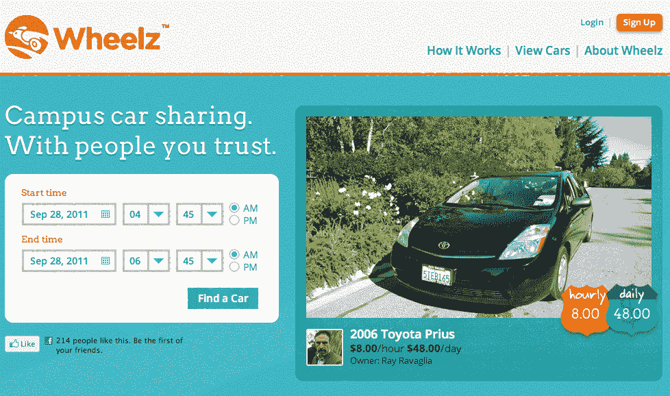

# Wheelz:汽车老兵推出 P2P 校园汽车共享平台，由前脸书副总裁 TechCrunch 提供支持

> 原文：<https://web.archive.org/web/http://techcrunch.com/2011/09/28/wheelz-automotive-veterans-launch-p2p-car-sharing-platform-backed-by-former-facebook-vp/>

今天，一个新的校园个人对个人的汽车共享平台 [Wheelz](https://web.archive.org/web/20230204223421/http://wheelz.com/) 进入了第五档，从秘密领域迅速进入公共领域，旨在将有车的学生和需要车的学生联系起来。诚然，当我第一次听到 Wheelz 的基础知识时，我立即想到，“gadzooks，另一个汽车共享平台！?"RelayRides、GetAround、Zimride、Zipcar 呢？总的来说，这些都是伟大的年轻企业，为这个领域增加了价值；当然，他们并不都是针对校园，但我不确定我们需要另一个。

不管你是否有同样的感觉，Wheelz 不敢苟同。这家初创公司最初在斯坦福大学(Stanford University)成立，它为校园带来了一个技术和服务平台，让学生和其他校园居民能够安全轻松地连接——通过脸书集成(一个好看的 iPhone 应用程序)和其专有的车载硬件系统 DriveBox。

脸书集成和移动应用程序是当今精明的在线企业的标准配置，但后一种功能却不是。一旦用户注册了 Wheelz，初创公司将免费在他们的汽车上安装 DriveBox(安装需要大约一个小时)，这将允许其他 Wheelz 成员使用初创公司的 iPhone 应用程序或 Wheelz 卡解锁汽车。对于那些没有时间见给他们钥匙的人，或者不想(不能)做一把新钥匙的人来说，这是一个很好的功能。

注册后，该公司会提供一个安全的“钥匙箱”，车主可以把钥匙放在里面，以便租车人可以启动汽车。钥匙盒里还有一张加油卡，这样当你的车低于油箱容量的四分之一时，开车的人就有责任用加油卡给车加油。车主负责汽油价格，汽油价格将从车主每月的总收入中扣除。

收益？什么收入？嗯，我的朋友，生活中很少有免费的午餐。驾驶你的车的人必须为使用你的车轮付费，所以每辆车都有由车主确定的每小时和每天的价格。尽管 Wheelz 声称它提供的是市场上最便宜的解决方案，但价格会因车型、车龄、用途等因素而有所不同。(此外，希望租赁更长时间的用户也可以设置每周股价)。

至于保险，只要用户借了 Wheelz 的车，他们就可以在使用汽车的整个过程中享受这家初创公司价值百万美元的保险。而且，根据 Wheelz 的网站，用户的“个人汽车保险绝不会受到”初创公司保险范围的影响。

其他一些漂亮的功能？Wheelz 提供各种各样的汽车，包括轿车、混合动力车、豪华车、敞篷车、货车、SUV，甚至一些卡车，此外，当您享受 Wheelz 预订时，您将能够利用免费的 24/7 客户支持和路边援助。

另一件有助于激发人们对这家初创公司信心的事情是，它在启动前筹集了 200 万美元的种子资金，由前脸书副总裁兼早期员工查马斯·帕利哈蒂亚(Chamath Palihaptiya)牵头(他最近离职，创立了社交+资本合伙风险基金)。加入 Palihapitiya 的还有风险投资公司 Felicis Ventures 和 Red Swan Ventures，以及一系列令人印象深刻的天使投资人，包括安永会计师事务所(Ernst & Young)前副主席吉姆·弗雷尔(Jim Freer)和 Playfish 创始人塞巴斯蒂安·德·哈莱克斯(Sebastien De Halleax)。

Wheelz 团队还为他们的新企业带来了丰富的汽车经验，包括创始人兼首席执行官 Jeff Miller，他在过去三年的大部分时间里专注于构建可持续交通解决方案，为电动汽车网络提供商 Better Place 工作。此外，Wheelz 联合创始人兼首席技术官 Akhtar Jame El(Wheelz 技术平台背后的设计师)曾担任梅赛德斯-奔驰 R&D 公司的首席执行官，并在戴姆勒、Better Place 和施乐 PARC 公司担任过高级产品和技术职务。

同样值得注意的是。贾米尔因在 1997 年开发出世界上第一辆联网汽车而被授予史密森尼计算机世界创新金奖。

当然，这并不意味着 Wheelz 注定会成功，他们仍然需要提供比竞争对手更值得信赖的服务，避免 Airbnb 式的公关混乱。这家初创公司的目标是通过该平台与脸书连接的集成来获得信任因素，以便学生们知道他们把车租给了谁，因为他们可以访问潜在汽车共享者的社交数据，以确保他们是真实的人，而不是最近从肖申克监狱出来的罪犯。

尽管肯定有一些有趣的技术在发挥作用，Wheelz 仍然不得不扼杀客户体验——否则他们就会像其他人一样走向天空中的初创企业死亡池。

“社交正在以一种深刻的方式改变每个行业，我们相信这是一个将彻底改变汽车所有权概念的团队，将汽车从财务负担转变为机遇”，Palihapitiya 说。“我之所以投资 Wheelz，是因为它的管理团队实力强大，而且在建立业务并将其推向市场方面考虑周到。”

更多关于 Wheelz 的信息，请看下面的视频:

http://youtu.be/QZcdb-58AXA