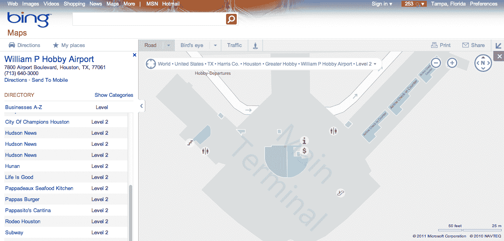

# Bing 发布 42 个美国城市的机场地图 TechCrunch

> 原文：<https://web.archive.org/web/http://techcrunch.com/2011/09/29/bing-launches-airport-maps-for-42-us-cities/>

# 必应发布美国 42 个城市的机场地图

微软的搜索服务 Bing 今天[宣布](https://web.archive.org/web/20230205033330/http://www.bing.com/community/site_blogs/b/maps/archive/2011/09/29/new-airport-maps-for-bing.aspx)推出全美 42 个主要机场的机场地图，并计划随着时间的推移扩展到其他机场。这项新功能现在可以在桌面上的必应地图中找到(一些机场地图以前可以在手机上找到[)。](https://web.archive.org/web/20230205033330/http://www.bing.com/community/site_blogs/b/search/archive/2011/08/03/new-airport-maps-for-bing-and-mall-maps-come-to-mobile.aspx)

有了它，您可以看到机场内部，以便找到航站楼、登记柜台、洗手间、商店、餐厅、行李认领处、问讯台等。

你可以通过在 Bing 上搜索机场名称、机场所在城市或其代码来找到新地图，或者你也可以搜索航班号并点击附带的“地图”链接。“airport maps”页面上的链接还可让您将地图发送到移动设备，以便以后访问。

在谷歌[发布其新的谷歌航班搜索功能](https://web.archive.org/web/20230205033330/https://techcrunch.com/2011/09/13/ita-powered-google-travel-launches-kayak-says-its-flight-search-is-superior/)后不久，谷歌通过[收购航班数据公司 ITA](https://web.archive.org/web/20230205033330/https://techcrunch.com/2011/04/13/after-agreeing-to-doj-settlement-google-closes-700m-acquisition-of-ita-software/)使其成为可能——这一举动是微软和其他公司一直在争取的。航班和旅游相关搜索一直是必应的优势之一，这要归功于早在 2008 年收购的[旅游价格搜索公司 Farecast 的早期整合。](https://web.archive.org/web/20230205033330/https://techcrunch.com/2008/04/17/microsoft-acquires-farecast-for-115m/)

谷歌提供了自己的机场地图(例如:[我这里的本地机场](https://web.archive.org/web/20230205033330/http://maps.google.com/maps?q=google+airport+maps&um=1&ie=UTF-8&ei=bKmEToiaOYiftwfu-LhH&sa=X&oi=mode_link&ct=mode&cd=3&ved=0CAkQ_AUoAg))，但地图在某些情况下仅限于机场布局，而不是里面的东西。例如，我的机场内部只显示了几家企业，如星巴克和汽车租赁站，但没有登记柜台或餐厅。对于更大的机场，如洛杉矶国际机场，谷歌可能会显示更多的数据，但仍然不完整。然而，随着谷歌推出[谷歌旅行](https://web.archive.org/web/20230205033330/http://www.google.com/flights/)，谷歌自己的机场地图服务会比现在更多，这只是时间问题。

此外，谷歌已经进入室内地图领域，甚至[为](https://web.archive.org/web/20230205033330/https://techcrunch.com/2011/05/05/google-brings-street-view-inside-businesses-unveils-google-earth-for-android-tablets/)[谷歌商业照片](https://web.archive.org/web/20230205033330/http://maps.google.com/help/maps/businessphotos/#utm_campaign=en&utm_medium=van&utm_source=en-van-na-us-gns-svn)提供商业内的街景照片。它将很快开始为机场提供街景，这并不令人惊讶。