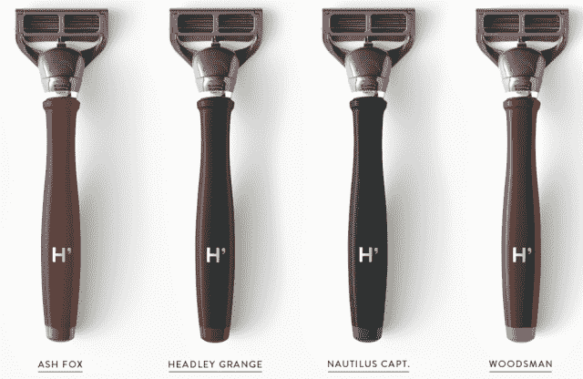

# 10 个月大的 Harry's Lands 以 1.225 亿美元收购了一家有 93 年历史的工厂，与剃须重量级企业 Gillette 和 Schick 展开较量 

> 原文：<https://web.archive.org/web/https://techcrunch.com/2014/01/22/10-month-old-harrys-lands-122-5m-buys-93-year-old-factory-to-go-toe-to-toe-with-gillette-and-schick/>

不是每个 10 个月大的初创公司都可以说，它跨越了几个大洋和国际边界，收购了一家有 93 年历史的工厂，或者为此筹集了 1.225 亿美元。然而，并不是每个互联网创业公司都试图在日常剃须领域掀起波澜，这个领域 85%的市场被几个久经风雨的巨头控制，如吉列和希克。更重要的是，虽然采用纯在线和直接面向消费者的模式可以帮助创业公司砍掉那个讨厌的中间人，但要真正减少市场中的摩擦和高成本，更快地迭代，你必须控制制造。

所以，这就是杰夫·莱德和联合创始人安迪·卡茨·梅菲尔德试图用哈利的《T1》做的事情。从 Tiger Global、Thrive Capital、Highland Capital、SV Angel 和其他几家公司筹集了 1.225 亿美元，Harry's 支付了 1 亿美元收购了[feinstechik](https://web.archive.org/web/20221209035934/http://www.feintechnik.com/)，这是一家自 1920 年以来一直生产剃须刀刀片的公司和工厂，也是 Harry 剃须产品的来源。

在推出他们的在线剃须用品初创公司之前，哈里的联合创始人走遍了世界各地，寻找最好的制造商，但最终他们选择了 Feintechnik。Raider 解释说，原因在于它在 90 多年的历史中生产了数十亿片刀片，以及制造双刃刀片的经验，并向欧洲各地的领先经销商销售。

创始人还表示，他们选择与 Feintechnik 合作是因为它的灵活性，不仅生产低端剃须刀中的刀片，还生产更复杂、更难生产的高端五刀片剃须刀中的刀片。自从 10 个月前推出以来，这些五刀片剃须刀已经成为[哈利的主打产品。](https://web.archive.org/web/20221209035934/https://beta.techcrunch.com/2013/03/14/warby-parker-co-founder-launches-harrys-bringing-the-startups-buy-one-donate-one-to-shaving/)

但此次收购背后的关键动机是走向垂直整合。通过收购 Feintechnik，Harry's 现在有能力控制其产品的设计和制造，并直接销售给消费者。

在剃须行业，只有少数公司能够创建垂直整合的生产和供应链。因此，尽管对一家公司来说，这在现阶段似乎是一个不寻常的举动(和投资)，但联合创始人相信，从长期来看，这将带来巨大的回报。另一部分原因是，哈利现在可以说，它已经加入了希克和吉列的“垂直整合俱乐部”，成为三人组。

虽然哈利是新一代“性感”电子商务公司的一员，这些公司试图为人们熟悉的日常产品和业务带来新的旋转——就像 Warby Parker 为眼镜所做的那样，Bonobos 为男装所做的那样——但这些年轻的品牌仍然在很大程度上依赖于第三方制造商。尽管 Raider 本人是 Warby Parker 的联合创始人，他的前公司已经成为直接面向消费者模式的典范，但即使是 Warby Parker 也不能说它真正控制了整个客户体验——从设计和分销到制造。

就像这种控制生产的能力以及他们品牌化方法的相似性，导致 Raider 在 Warby Parker 的三位联合创始人加入了这家初创公司的最新一轮。重要的是，这一投资使这家成立仅 10 个月的初创公司扭亏为盈——这要归功于 Feintechnik 业务现有的盈利能力。

至于其收购 Feintechnik 后剩余的 2250 万美元投资？创始人表示，该公司计划扩大其受 Warby Parker 启发的时尚剃须产品组合，自推出以来，这些产品已售出“超过 10 万个剃须刀”。他们解释说，关键是创造一个将价值与精品、经典感觉相结合的消费产品品牌。

哈里的剃须套装提供一把剃须刀、三个替换刀片和剃须膏，每把 15 美元，相比之下，大多数人会认为这是一笔交易，比如说，受欢迎的吉列剃须刀售价 12 美元，但只包括两个替换刀片。两者都是五刀片剃须刀，但其售价为 25 美元的“更好”的手柄，与吉列和希克提供的类似产品相比，仍然是一笔相当不错的交易。除了以价值为导向的方法，哈利的近期和长期计划旨在增加其对年轻、精通技术的消费者的吸引力。

这意味着该公司也在努力开发其基于数据的印章。例如，今天，Harry's 已经开始跟踪客户的购买习惯，以便允许他们在认为是时候购买新刀片式服务器时向这些客户发送电子邮件。随着其客户群的扩大，以及收集更多关于他们风格和品味的数据，该公司将寻求扩展这种功能，为其购物体验带来更多亚马逊风格的个性化。

此外，尽管 Harry's 的剃须刀传统上只有数量有限的设计和套件，但随着其新的投资和垂直整合的供应链的发展，该公司将寻求增加其产品阵容。在短期内，这意味着客户可能会期待哈里既扩大其季节性启发的产品线，以及其核心剃须套件。

虽然创始人声称他们今天没有什么具体的目标，但看到该公司蹑手蹑脚地进入，比如说，电子剃须刀，并进一步扩展到更大的男性美容市场也不会令人意外。在不太遥远的将来，你可能会发现自己正在使用哈利品牌的须后水或除臭剂。