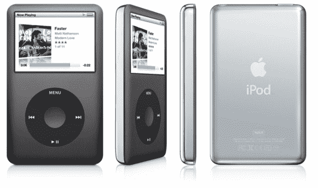

# iPod 10 年 

> 原文：<https://web.archive.org/web/http://techcrunch.com/2011/10/23/10-years-of-the-ipod/>

2001 年 10 月 23 日，史蒂夫·乔布斯在一次特别活动中介绍了 iPod，展示了一个注定会成为标志性的设计。十年后，这个品牌一如既往地强大，尽管很遗憾，我们失去了它的发明者。

花几分钟时间观看最初的产品发布，并简短地回顾一下苹果历史上最重要的设备的演变。

【YouTube http://www.youtube.com/watch?feature = player _ detail page & v = kn 0 svbcjqls w = 640]

我说最重要是因为虽然 Mac Classic、iMac 以及后来的 iPhone 对一些人来说同样享有盛名，但我认为 iPod 是一个分水岭。如果 iPod 失败了，苹果将仍然是一个被设计师和学校珍视的精品电脑制造商，但可以被整个科技界安全地忽视。相反，iPod 被证明是一个强大的楔子，多年来事实上的听音乐标准；事实上，在它最终让位于智能手机等更加一体化的设备之前，它还有很多年要走。即便如此，这个品牌也将经久不衰。

苹果的这一楔入给了他们大众市场的可信度，极大地提高了销量，并确立了 iTunes 作为一股将颠覆整个行业的市场力量的地位。

多年来，iPod 本身也发生了变化。但任何人都可以看到今天的 160GB iPod Classic，并认出原来的版本是它的前身。有人说，目前的模式(自 2008 年底以来或多或少以目前的形式提供)是时候更换了。不过，它已经被一些设备取代了。苹果似乎将经典作为一种公共服务提供，拒绝将这些销售转移到新设备上，也许是出于对其遗产的尊重。

但也有失误:第三代 iPod 的触摸按钮系列没有持续很长时间，第一代彩色机型的彩色屏幕也不是特别引人注目。老实说，“胖纳米”是一个嘲笑的对象。整个电池事故处理得很糟糕。但是这些问题都得到了纠正，每次，消费者都会想“啊—*现在*完成了。”然后，当然，iPhone 出现了。

对于一个消费电子品牌来说，10 年是很长的一段时间，更不用说外形或外观了。我敢打赌，几乎每个阅读这篇文章的人都拥有这样或那样的 iPod，并且可能在某个地方藏了一个 iPod 存储器。就我个人而言，我记得在 2005 年的圣诞节收到了一个第五代 iPod，我一直抱怨，直到第二天我们可以去商店把我的白色换成黑色。对我来说，这不是一个值得骄傲的时刻，但也许这是苹果的一个时刻。

因此，让我们向有史以来最重要的消费电子产品之一致敬。欢迎在下面分享你的想法和回忆。