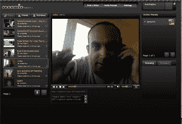

# 100 个 Seesmic 账户和一份披露 

> 原文：<https://web.archive.org/web/https://techcrunch.com/2007/11/20/100-seesmic-accounts-and-a-disclosure/>

# 100 个 Seesmic 账户和一份披露

  现在最难获得测试版账号的是 [Seesmic](https://web.archive.org/web/20230219180831/http://www.seesmic.com/) ，Loic Le Meur 的新创业公司[于 10 月初进入私人测试版](https://web.archive.org/web/20230219180831/https://techcrunch.com/2007/10/08/loic-le-meurs-new-startup-launches-seesmic/)。

这项服务很容易被描述为视频推特，目前已经有 300 人在测试它，它很受欢迎。Le Meur 说，他们中的一半以上非常活跃，每天有 200 个视频被发布。

测试邀请名单上有超过 5000 人。但是如果你足够快地到达这个位置，你可以立即进入。前 100 名向 techcrunch@seesmic.com 发送电子邮件的人将获得 beta 账户。前 100 名之后的每个人都将被添加到测试列表中。

Le Meur 说，在某个时候，现有的测试版持有者也可以邀请其他人加入。一旦该功能上线，我们会将 Seesmic 添加到[邀请共享](https://web.archive.org/web/20230219180831/http://www.inviteshare.com/)中。

披露:我也成为了 Seesmic 的投资者，并在我们的“关于”页面上更新了我的[披露信息](https://web.archive.org/web/20230219180831/https://techcrunch.com/about-techcrunch/)。