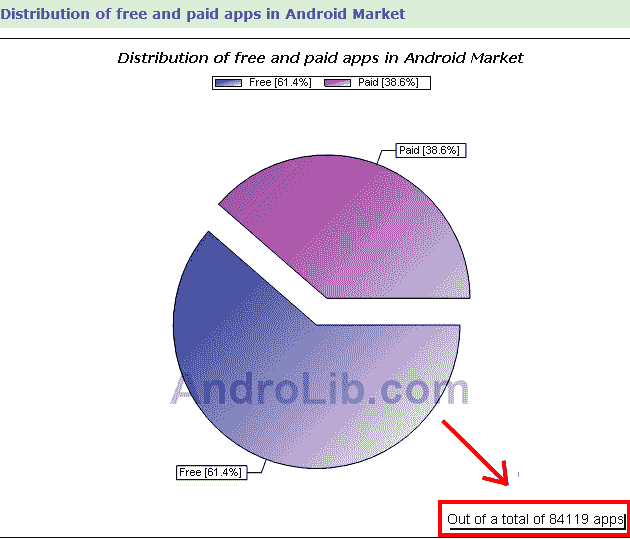

# 安卓市场 10 万个应用？还没有 

> 原文：<https://web.archive.org/web/https://techcrunch.com/2010/07/16/100000-applications-in-android-market-not-just-yet/>

# 安卓市场 10 万个应用？这会儿还不

[Engadget](https://web.archive.org/web/20221204145955/http://www.engadget.com/2010/07/15/android-market-now-has-100-000-apps-passes-1-billion-download-m/) 和 [InformationWeek](https://web.archive.org/web/20221204145955/http://www.informationweek.com/news/hardware/handheld/showArticle.jhtml?articleID=225800262) 报道称[Android lib](https://web.archive.org/web/20221204145955/http://www.androlib.com/)收集了 [Android Market](https://web.archive.org/web/20221204145955/http://www.android.com/market/) 的各种统计数据，该商店中 Android 应用程序的数量为 10 万个。我的问题是:他们从哪里得到这些？

确实，AndroLib 估计下载总数现在已经超过了 10 亿个应用程序，就像我们几天前报道的那样，当时 AndroLib 推出了一个重新设计的网站，以接近实时的数据为特色。正如《信息周刊》指出的那样，这个数字正在快速攀升，在记者发帖的这段时间里增加了 10 万人。

但是商店里总共有 100，000 *个*应用程序，正如两家公司所说的那样？还没有。

AndroLib 还在本页面上清晰地记录了免费和付费应用在 Android Market 中的分布情况，他们称商店中的应用总数刚刚超过 84，000 个，非常接近谷歌昨天在财报电话会议上公布的数字(70，000 个应用)。仍然有差异，但差距没有 Engadget 报道的那么大。

**更新:**Android lib 表示，他们统计了世界各地发布的 Android 应用，谷歌可能为他们的收益电话会议保留了一个不错的整数——他们还认为他们有时可能会统计最近从市场上删除的应用。AndroLib 还声称可用应用程序的数量有时每天增长 1000 多个。

那么，Android 市场上的应用程序总数会像本月早些时候 AndroidGuys 的家伙们预测的那样，很快超过 10 万吗？是的，几乎可以肯定，甚至在接下来的几周内。但是现在还不是时候。