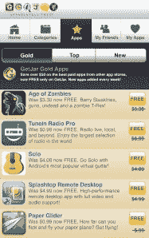

# GetJar Gold 赠送价值 100 万美元的免费应用 TechCrunch

> 原文：<https://web.archive.org/web/http://techcrunch.com/2011/09/29/getjar-gold-gives-away-1-million-in-free-apps/>

本月早些时候，第三方移动应用商店 GetJar [宣布公开推出其](https://web.archive.org/web/20230203145630/https://techcrunch.com/2011/09/08/watch-out-amazon-getjar-launches-a-full-catalog-of-premium-android-apps-for-free/) [GetJar Gold](https://web.archive.org/web/20230203145630/http://www.getjar.com/gold) 计划(之前处于测试阶段)，这是一个免费提供的高级 Android 应用程序目录。今天，该公司提供了该目录成功的最新消息:Get Jar 表示，在发布后的三周内，超过 100 万美元的免费应用程序被下载。这也刺激了 GetJar 免费应用程序下载量的增长——事实上，增长了 5000%。

GetJar Gold 程序很有趣，尤其是与亚马逊的 Android 应用商店相比。亚马逊向 Android 用户提供有时间限制的“每日免费应用”，而 GetJar 则免费提供整个付费 Android 应用目录。像亚马逊一样，GetJar 审查应用程序的质量(它们必须至少是 4 星)，并要求它们是无广告的。

 发布时，商店有 50 款游戏可用，包括水果忍者 THD、僵尸时代、TuneIn Radio Pro、Solo 和 Splashtop Remote Desktop。自那以后，GetJar 增加了新的程序成员，如 BBC Worldwide (Top Gear)、Gamelion (Doodle Fit)、Konami(疯狂卡丁车赛)、Imperio、Handy Games“Guns ' n ' Glory”、Herocraft 的“Farm 狂热”和 TouchType 的“SwiftKey X”。

GetJar Gold 向用户免费提供应用程序，同时以委托的方式向开发者支付每次下载的费用。该公司本身通过向其他应用程序开发者提供 GetJar Gold 中的赞助列表来产生收入。

使用一种类似于 Google AdSense 的模式，开发者对他们愿意支付的每次安装费用进行竞价。每个用户的出价可以低至 1 美分，也可以高达 1.5 美元到 2.00 美元。出价越高，在 GetJar Gold 搜索结果中的排名就越高。也像谷歌一样，赞助应用程序用不同的颜色(蓝色)清晰地标记和突出显示。

GetJar 首席执行官 Ilja Laurs 表示，Gold 是该公司历史上最成功的程序，这并不奇怪，因为 Android 用户非常喜欢他们的免费应用程序。

[GetJar Gold](https://web.archive.org/web/20230203145630/http://www.getjar.com/gold) 可在 GetJar.com 网站和手机网站上购买。