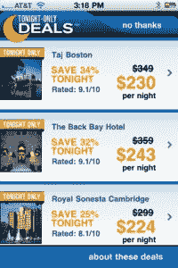

# Priceline 进军每日交易领域(实际上是夜间交易领域)

> 原文：<https://web.archive.org/web/http://techcrunch.com/2011/09/29/priceline-jumps-into-daily-deals-space-actually-nightly-deals-space/>

旅游折扣公司 Priceline.com 推出了一项新的每日优惠服务，旨在帮助用户找到便宜的酒店房间。(或者称之为“夜间”交易服务更准确？)

从今天开始，当地时间上午 11 点，Priceline 的“[酒店&租车谈判代表](https://web.archive.org/web/20230203133944/http://www.priceline.com/promo/iphone_negotiator_app.asp)”应用程序将提供大幅折扣酒店房间的当天优惠，并可以立即预订到晚上 11 点，或直到交易售罄。

需要澄清的是，Priceline 在这里并没有使用 Groupon 的团购模式，这种模式要求一定数量的人注册交易才能“小费”(意思是变得活跃。)但它肯定是在利用 Groupon、Living Social 等服务提供的折扣热情带来的即时满足感。

当旅行者搜索入住日期为“今天”的酒店房间时，这些交易将显示在移动应用程序中 Priceline 表示，当他们购买一项交易时，他们可以选择当天入住，并以高达公布价格 35%的折扣住四晚。该应用程序还将显示酒店描述、地图、照片、评级和当前折扣率。

Priceline SVP 营销 John Caine 表示，该折扣店在发现 Priceline 70%的移动客户都在寻找当天入住服务后，决定进军每日特惠市场。

从今天开始，3 星和 4 星客房将通过这项新服务在美国 34 个城市提供，包括亚特兰大、波士顿、芝加哥、达拉斯、丹佛、佛罗里达。劳德代尔、檀香山、休斯顿、拉斯维加斯、洛杉矶、迈阿密、新奥尔良、纽约、凤凰城、波特兰、圣安东尼奥、圣地亚哥、旧金山、圣达菲和华盛顿特区。未来还会增加更多城市。

Priceline 移动应用程序在 iTunes 和 T2 安卓市场都有售。

*更新:Priceline 在这一领域的顶级竞争对手 Hotel Tonight 刚刚[宣布](https://web.archive.org/web/20230203133944/http://gigaom.com/2011/09/29/hotel-tonight-looks-beyond-biz-travelers-to-vacations/)将从最初的 23 个市场扩展到 14 个市场。好时机！*