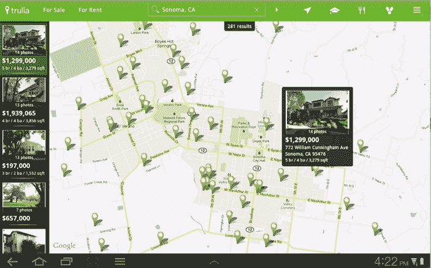

# 房地产平台 Trulia 首次推出 Android 平板电脑和租赁应用| TechCrunch

> 原文：<https://web.archive.org/web/https://techcrunch.com/2011/09/29/real-estate-platform-trulia-debuts-android-tablet-and-rentals-apps/>

# 房地产平台 Trulia 推出 Android 平板电脑和租赁应用

房地产搜索引擎 Trulia 今天正在扩展其移动产品，推出了一款新的 Android 平板电脑应用程序和一款专门用于租赁的 Android 应用程序。该公司已经提供了全面的 iPhone、iPad、Android 和移动网络应用程序，这些应用程序具有该网站的大部分功能。

Trulia 的 Android 平板电脑应用程序与 iPad 应用程序类似，它使用全屏显示酒店照片和一个带有酒店的大型交互式地图。该应用程序是 Android 独有的，允许您在平板电脑的整个屏幕上查看属性幻灯片。您还可以查看餐厅、学校和其他感兴趣的地方与待售或出租房屋的关系，并访问房产代理的联系信息。

由于租赁信息是 Trulia 业务中如此受欢迎的一部分，该公司正在为这一垂直行业推出一款专用应用。正如 Trulia 解释的那样，租房者通常比买房者的时间线短得多，因此他们需要更快地行动，并实时访问可能只有短暂上市时间的房产。

该应用程序显示你所在地区的租赁物业，你可以通过应用程序保存或取消物业。颜色编码的“标记”将显示您尚未查看的属性与之前查看的属性。您还可以在游览时将自己的照片和笔记添加到酒店，并从应用程序访问最近列出的酒店的搜索提醒。

该公司表示，它也在为亚马逊市场开发，并打算在 11 月进入亚马逊应用商店。在 T2 盈利的 Trulia，T3 已经为 T4 筹集了 3280 万美元的资金。去年，该公司[收购了地理数据初创公司 Movity，](https://web.archive.org/web/20230315160829/http://www.techmeme.com/101221/p4#a101221p4)，流量在过去的一年里稳步增长。

