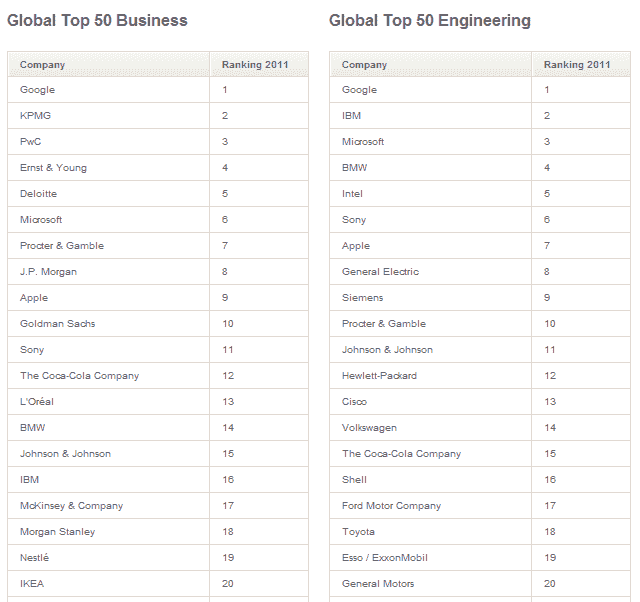

# 报告:谷歌仍然是商业、工程学生中“最有吸引力的雇主”

> 原文：<https://web.archive.org/web/http://techcrunch.com/2011/09/29/report-google-remains-most-attractive-employer-among-business-engineering-students/>

# 报告:谷歌仍然是商业和工程专业学生中“最有吸引力的雇主”

专门从事雇主品牌推广的公司 Universum ，[发布了](https://web.archive.org/web/20230314022204/http://www.universumglobal.com/Top50)一些[的调查结果](https://web.archive.org/web/20230314022204/http://www.prnewswire.com/news-releases/google-is-the-worlds-most-attractive-employer-130755878.html)，这些调查结果基于来自世界 12 个最大经济体的 16 万多名具有商业或工程背景的求职者的偏好(基于名义 GDP)。

目标是:根据商业和工程专业的学生，找出哪家公司是最有吸引力的雇主。

好吧，这是不争的事实:谷歌在这两个类别中都稳坐第一名——就像去年和前年一样。

微软也不算太差，而苹果正在快速攀升。脸书在排名中也不见踪影(好吧，推特、雅虎和令人震惊的美国在线也不见踪影)。

在商业指数上，毕马威保持其第二名的位置，普华永道超过安永，最终进入前三名。显然，专业服务公司的排名仍然高于主要的科技和 FCMG 公司(当然，不包括谷歌)。

与去年相比，苹果在商业指数中从第 18 位上升到第 9 位，考虑到苹果目前是世界上最有价值的公司，这仍然非常低。与此同时，微软在排名中从第七位升至第六位。

至于工程指数，也是由谷歌领导的:IBM 现在发现自己处于第二位，把微软挤到了第三位。英特尔和苹果的排名都上升了(分别从第 6 名升至第 5 名和第 10 名升至第 4 名),索尼在雇主吸引力方面从第 6 名降至第 4 名。

(图片由 [Flickr 用户 brionv](https://web.archive.org/web/20230314022204/http://www.flickr.com/photos/brionv/136777729/) 提供)

