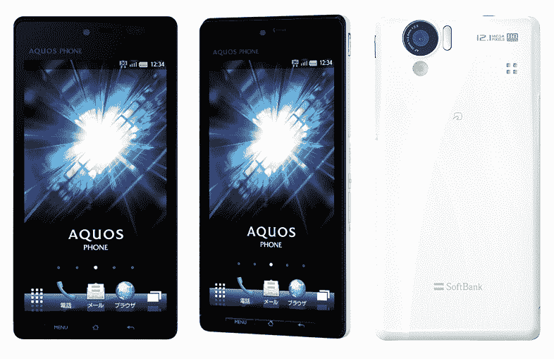

# 夏普新款安卓手机:防水机身，4.5 英寸 3D QHD 显示屏，1200 万像素摄像头，DLNA TechCrunch

> 原文：<https://web.archive.org/web/http://techcrunch.com/2011/09/29/sharps-new-android-phone-waterproof-body-4-5-inch-3d-qhd-display-12mp-cam-dlna/>

# 夏普新款安卓手机:防水机身，4.5 英寸 3D QHD 显示屏，1200 万像素摄像头，DLNA

[夏普](https://web.archive.org/web/20230203074624/https://techcrunch.com/tag/sharp)最近一直在为日本市场生产相当[一款](https://web.archive.org/web/20230203074624/https://techcrunch.com/2011/09/26/japan-gets-8-new-cell-phones-kddis-entire-winter-line-up/?utm_source=feedburner&utm_medium=feed&utm_campaign=Feed%3A+Techcrunch+%28TechCrunch%29&utm_content=Google+Reader) [几款](https://web.archive.org/web/20230203074624/https://techcrunch.com/2011/05/11/sharp-rolls-out-sharp-aquos-phone-with-8mp-twin-3d-cameras-naked-eye-3d-qhd-display-android-2-3/)好看的[安卓](https://web.archive.org/web/20230203074624/https://techcrunch.com/tag/android)手机(占有 25%的份额，是这里的领先厂商)，今天，该公司[推出了](https://web.archive.org/web/20230203074624/http://www.softbankmobile.co.jp/ja/news/press/2011/20110929_07-page_04/)【JP】另一款外观很棒的手机，AQUOS PHONE 102SH。

当地运营商软银将于 12 月开始在日本销售这款手机，作为其秋冬系列的一部分。现在，人们可能会怀疑，这种模式是否能让用户得到一个真正的怪物。

以下是主要规格:

*   安卓 2.3
*   4.5 英寸裸眼 3D 液晶屏，分辨率为 720×1280，像素密度为 329dpi
*   1200 万像素 CMOS 摄像头，支持全高清视频录制
*   兼容软银的“Ultra Speed”高速数据通信服务(max。21Mbps)
*   TI OMAP4430 双核 CPU (1GHz)
*   内存:1GB，只读存储器:2.2GB
*   防水机身(IPX5/7，IP5X)
*   IEEE802.11b/g/n Wifi
*   蓝牙 3.0
*   DLNA 支持
*   microSDHC 卡插槽
*   红外连接
*   电子钱包功能
*   数字电视调谐器
*   W-CDMA、GSM
*   尺寸:128×65×9.7 毫米，重量:135 克

这款手机会走出日本吗？也许:[早在五月](https://web.archive.org/web/20230203074624/https://techcrunch.com/2011/05/24/sharp-plans-to-introduce-android-aquos-phone-brand-worldwide/)，夏普说他们将在未来的某个时候在全球范围内推出 AQUOS 手机…