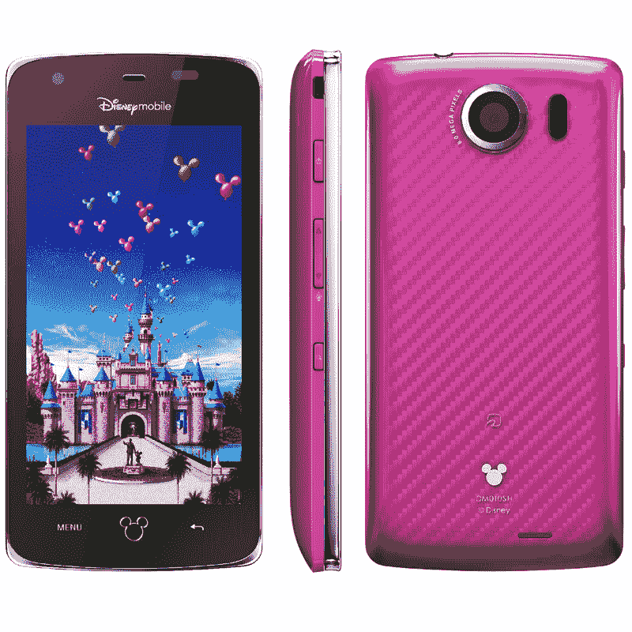

# 迪士尼移动日本公司发布两款(可爱的)安卓手机 TechCrunch

> 原文：<https://web.archive.org/web/https://techcrunch.com/2011/09/30/disney-mobile-japan-announces-two-cute-android-phones/>

# 迪士尼移动日本公司发布两款(可爱的)安卓手机

自 2008 年以来，迪士尼一直作为 MVNO 在日本开展业务(迪士尼移动)，昨天在[发布了两款新的 Android 手机](https://web.archive.org/web/20230205014403/http://disneymobile.jp/cam/2011winter/)(JP)。DM010SH 将于 10 月在日本上市，随后 DM011SH 将于 12 月上市(价格待定)。

从技术上来说，DM010SH 基于夏普的[AQUOS 009 sh](https://web.archive.org/web/20230205014403/http://mb.softbank.jp/mb/smartphone/product/009sh/)【JP】，采用 Android 2.3，4 英寸液晶显示器，QHD 分辨率，800 万像素 CMOS 摄像头，蓝牙，Wi-Fi，microSDHC 插槽，数字电视调谐器，电子钱包功能，红外通信等。

 

DM011SH 基于夏普的 AQUOS 007SH，这是功能手机和智能手机的奇怪组合。规格:Android 2.3，防水机身，3.4 英寸液晶触摸屏，854×480 分辨率，16MP CCD 摄像头，1280×720 高清视频录制，Wi-Fi，蓝牙，数字电视调谐器，电子钱包功能等。(还有一款 [Hello Kitty 手机](https://web.archive.org/web/20230205014403/https://techcrunch.com/2011/08/19/softbank-007sh-kt-hello-kitty-branded-clamshell-android-phone/)也是基于这款机型)。

 

迪士尼手机将为手机提供特殊内容，例如显示迪士尼人物和图标的主屏幕、迪士尼主题计算器、日历、闹钟和其他应用程序(见下文)。

 

该公司已经在日本销售迪士尼安卓手机。