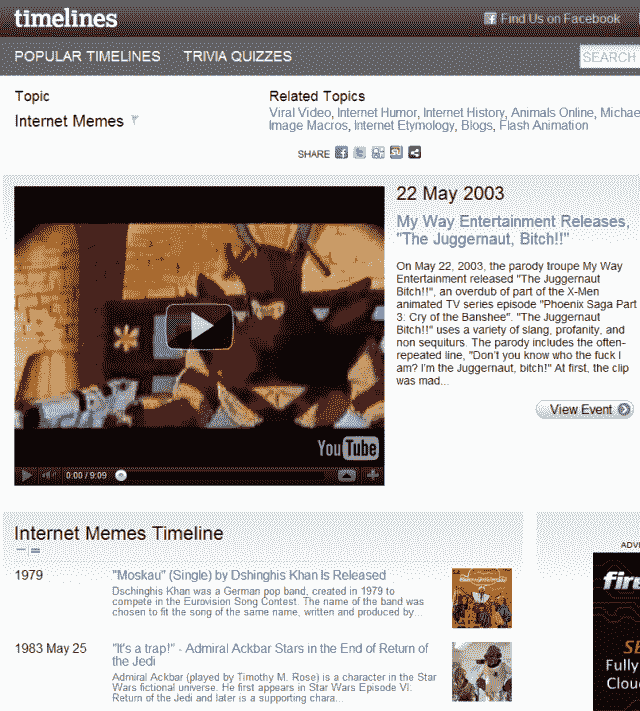

# Timelines.com 起诉脸书，称其新的时间线功能可以“消灭”他们

> 原文：<https://web.archive.org/web/http://techcrunch.com/2011/09/30/timeslines-facebook-timeline-trademark-lawsuit/?utm_source=feedburner&utm_medium=feed&utm_campaign=Feed%3A+Techcrunch+(TechCrunch>)

# Timelines.com 起诉脸书，称其新的时间线功能可以“消除”他们

由风险投资支持的芝加哥小公司 Timelines Inc. 运营着[Timelines.com](https://web.archive.org/web/20230203152209/http://timelines.com/)网站，该公司于周四对脸书发起了[商标侵权诉讼](https://web.archive.org/web/20230203152209/http://dockets.justia.com/docket/illinois/ilndce/1:2011cv06867/260613/)，声称后者[最近宣布的](https://web.archive.org/web/20230203152209/https://techcrunch.com/2011/09/22/facebook-timeline/) [Timeline 功能](https://web.archive.org/web/20230203152209/https://techcrunch.com/2011/09/22/how-to-enable-facebook-timeline/)可能“很有可能消除”其整个业务。

Timelines.com 是一个基本上允许人们记录和分享个人或历史事件的网站，并提供与这些事件、人物、公司、乐队等相关的描述、链接、照片和视频(即[古巴导弹危机](https://web.archive.org/web/20230203152209/http://timelines.com/topics/cuban-missile-crisis)、[艾尔·卡朋](https://web.archive.org/web/20230203152209/http://timelines.com/topics/al-capone)和[平克·弗洛伊德](https://web.archive.org/web/20230203152209/http://timelines.com/topics/pink-floyd))。

该诉讼实质上声称脸书的[时间线服务](https://web.archive.org/web/20230203152209/http://www.facebook.com/about/timeline)(见他们发布该功能的[博客帖子](https://web.archive.org/web/20230203152209/http://blog.facebook.com/blog.php?post=10150289612087131))有可能让时间线公司直接退出~~康普顿~~的业务。

来自投诉(也嵌入在下面):

> 此事旨在保护总部位于芝加哥的一家小公司 Timelines，使其免于被世界上最大和最强大的社交媒体公司脸书的非法行动所推翻，甚至很可能被淘汰。
> 
> 脸书已经宣布打算使用，事实上已经开始重新定向互联网流量，使用 TIMELINES 在联邦政府注册的“Timelines”商标作为脸书未来新产品的核心，鉴于脸书的规模和影响力，这一举动将基本上消除 Timelines，并给公众留下原告 Timelines 与脸书有某种联系的混淆印象。
> 
> 如果脸书被允许继续发布其“时间线”产品，消费者将会对时间线现有的“时间线”网站产生混淆。

该诉讼还称，Facebook.com/timelines,曾将“时间线”的脸书页面链接到了脸书的网址上(讽刺的是，该网址仍链接在 Timelines.com 网站的顶部):

> 脸书的“时间线”服务及其对试图访问时间线服务的用户的误导旨在阻止互联网用户访问关于 Timelines.com 的信息，并允许用户转而使用脸书的“时间线”服务。

**更新:**脸书拒绝置评，但还是悄悄地恢复了时间轴的脸书页面。

Timelines 是注册商标“Timelines”的所有者。第 3，684，074 号)、“Timelines.com”(美国注册第 3，764，134 号)和“时间表与设计”(美国注册第 3784720 号)。

[scribd id = 66937001 key = key-1 z 0 bhc 1t qu 1 o6 x4 gr 4 b mode = list]

