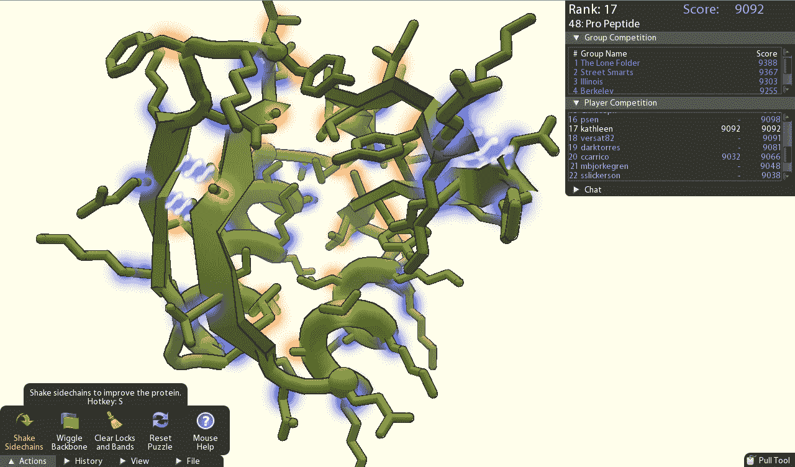

# 第一个:游戏玩家帮助科学家解决可能导致艾滋病疫苗的分子难题 TechCrunch

> 原文：<https://web.archive.org/web/http://techcrunch.com/2011/10/01/one-up-gamers-help-scientists-solve-molecular-puzzle-that-could-lead-to-aids-vaccine/>

所以，这不完全是突发新闻，但它太棒了，值得再次分享，以防你错过了它。自从 1981 年发现艾滋病毒以来，科学家们一直在努力寻找治疗方法。虽然研究人员仍未找到治愈方法，但已开发出几种蛋白酶抑制剂来减缓其进展。但是上周，艾滋病毒/艾滋病研究向前迈出了一大步，[多亏了游戏玩家](https://web.archive.org/web/20230205013817/http://blogs.wsj.com/tech-europe/2011/09/21/gamers-solve-aids-puzzle/?mod=google_news_blog)的工作。是的，游戏玩家。

大约三年前，华盛顿大学的一组研究人员创造了一款名为 [FoldIt](https://web.archive.org/web/20230205013817/http://fold.it/portal/) 的游戏，让游戏玩家通过玩蛋白质的形状和结构来为科学研究做出贡献。为什么是蛋白质？人体内有超过 10 万种蛋白质，了解这些蛋白质的结构和组成是了解它们如何工作以及设计针对它们的药物的关键。

由于蛋白质存在于我们所患的大多数疾病中，它们也是开发治疗方法的关键，因此 FoldIt 使游戏玩家能够设计新的蛋白质，并将已知的蛋白质折叠成最可行的形式，以努力促进疾病预防。

根据 Foldit 的网站，“FoldIt 试图通过利用人类的解谜直觉来预测蛋白质的结构，并让人们竞争折叠最好的蛋白质”。

上周，FoldIt 不仅仅是一个很酷的想法，或者是具有科学头脑的游戏玩家的一个练习。15 年来，科学家一直试图破译一种名为“逆转录病毒蛋白酶”的蛋白质，因为这种蛋白酶是允许艾滋病毒在活细胞中繁殖和复制的关键蛋白质之一。使用 FoldIt，游戏玩家能够在大约 10 天内识别蛋白质的结构。

随着逆转录病毒蛋白酶结构的解开，科学家们现在可以开始采取必要的步骤来制造一种可以显著减缓艾滋病毒发展速度的药物。这些发现最初发表在《自然》杂志的一篇文章中，读者可以在这里找到这篇文章。

“在通过分子置换解决 M-PMV 逆转录病毒蛋白酶晶体结构的广泛尝试失败后，我们向蛋白质折叠游戏 Foldit 的玩家提出挑战，要求他们制作蛋白质的精确模型”，华盛顿大学研究小组在其研究结果中表示。“值得注意的是，Foldit 玩家能够为成功的分子替换和随后的结构确定生成足够高质量的模型。精细的结构为抗逆转录病毒药物的设计提供了新的见解”。

[在 MSNBC 报道](https://web.archive.org/web/20230205013817/http://cosmiclog.msnbc.msn.com/_news/2011/09/18/7802623-gamers-solve-molecular-puzzle-that-baffled-scientists)中，游戏玩家描述了他们如何合作解决困扰科学家十多年的难题。最酷的是，虽然游戏中一些最重要的进展是由具有生物医学学术背景的人取得的，但大多数玩 FoldIt 的活跃玩家并没有这种科学背景。他们中的许多人只是像你我一样的普通玩家。

“猴子病毒谜题的解决方案表明，Foldit 和其他以科学为导向的视频游戏可以用于解决其他广泛的科学挑战——从药物开发到未来生物燃料的基因工程，”华盛顿大学的生物化学家菲拉斯·哈提卜告诉 MSNBC。“我希望科学家们能看到这项研究，并给我们更多这样的案例”。

对于游戏化的非浅端来说，这是多么了不起的胜利。我们经常听说游戏层如何被添加到消费科技产品中，以鼓励与产品和应用的参与和互动，但通过 FoldIt，我们有了一个真实的例子，说明游戏化如何帮助解决一些最棘手的科学问题，并帮助让世界变得更美好。

好样的，玩家们。