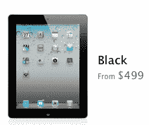
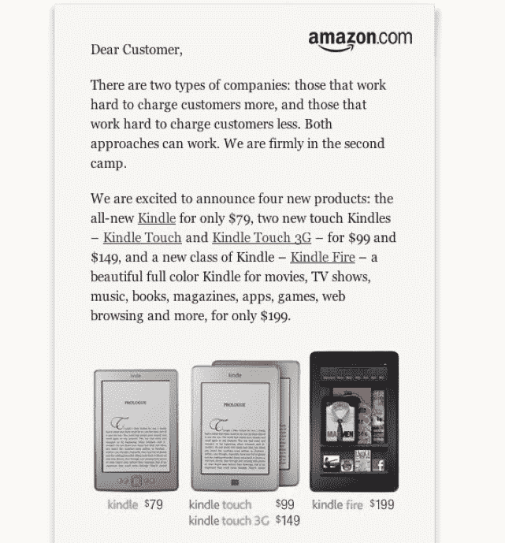

# 亚马逊用 Kindle Fire 199 美元的价格给苹果“重重一击”

> 原文：<https://web.archive.org/web/https://techcrunch.com/2011/10/02/amazon-punches-apple-hard-with-kindle-fires-199-price/>

# 亚马逊用 Kindle Fire 199 美元的价格“给苹果重重一击”

凭借 Kindle Fire，亚马逊首次进军平板电脑市场，在这个市场上，苹果凭借其 iPad 占据主导地位，其他任何产品都无法撼动。基于安卓系统的 Kindle Fire 是一款令人印象深刻的媒体平板电脑，杰夫·贝索斯明白设备本身只是等式的一部分。它只是一系列端到端服务的前端，这些服务将把数字媒体从亚马逊的服务器送到人们手中。

但是 Kindle Fire 不是 iPad，贝佐斯也知道这一点。所以他用其他东西来区分 Fire 和 iPad:价格。fire 199 美元的价格几乎让所有人都大吃一惊。比最便宜的 iPad 2 低 300 美元。因此，即使它功能不全，运行不流畅，应用程序数量少得可怜(~~不到 1~~ 约为 iPad 应用程序数量的 15%，目前超过 10 万)，所有这些都无关紧要。因为如果它足够好，数百万人会决定花 199 美元购买它，而不是花 499 美元买一台 iPad。

 作为有规模的零售商，亚马逊的优势之一一直是价格。Kindle Fire 已经是亚马逊上销量第二的 Kindle(第一名是售价 79 美元的新款 Kindle ),苹果在 Kindle Fire 上有效地利用了这一功能。 ***更正**:Fire 实际上是亚马逊上目前最畅销的电子产品。Kindle Fire 没有推出 3G 服务，只有 WiFi，这是有原因的。亚马逊不得不尽一切努力把价格降到 199 美元。*

贝佐斯知道他无法正面挑战苹果。相反，他正在竭尽全力为亚马逊在平板电脑市场开拓新的空间，而价格是其中很大的一部分。在亚马逊主页上的一封致顾客的信中，用投资者约翰·博思威克的话说，他“给了苹果重重的一拳”。信的开头是:

> 有两种类型的公司:努力向客户多收费的公司和努力向客户少收费的公司。这两种方法都可行。我们坚定地站在第二阵营。

贝佐斯在上周发布新的 Kindle 产品线时也表达了同样的观点。“我们正在以非高端价格生产高端产品，”他说。当然，苹果以高价生产优质产品。它将不得不通过进一步降低 iPad 的价格来应对，还是会坚持走高端路线？

https://twitter.com/#!/Borthwick/status/120139578047864832

