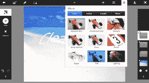

# Adobe 凭借 6 款新应用和“创意云”| TechCrunch 进军平板电脑领域

> 原文：<https://web.archive.org/web/https://techcrunch.com/2011/10/03/adobe-pushes-into-tablet-space-with-6-new-apps-and-creative-cloud/>

# Adobe 凭借 6 款新应用和“创意云”进军平板电脑领域

Adobe 今天很忙。随着[收购 Nitobi Software](https://web.archive.org/web/20230320171516/https://techcrunch.com/2011/10/03/adobe-acquires-developer-of-html5-mobile-app-framework-phonegap-nitobi/) 和 TypeKit，该公司还明确进军平板电脑领域，寻求加强内容创作。在洛杉矶举行的 Adobe MAX 2011 大会上，Adobe 正式宣布了 Creative Cloud——它自己的云存储服务——以及六款适用于 Android 平板电脑和 iPad 的新 Adobe Touch 应用程序。

Creative Cloud 允许用户同步、共享和查看来自 Adobe Creative Suite(桌面)和 Adobe Touch 应用程序的文件。它提供 20GB 的免费存储空间，尽管价格和可用性要到 11 月份才会公布。然而，创意云(一旦投入使用)肯定会提升六款新触控应用的价值，其中最值得注意的是 Adobe Photoshop Touch。

以下是每个新应用的快速运行:

*   **Adobe Photoshop Touch:** 这是新应用中的佼佼者，因为几乎每个人都可以在 Photoshop 中找到乐趣。该应用程序允许用户对图像进行分层，以与 Photoshop 中相同的方式进行编辑，并为图像添加效果。Adobe 还增加了一个仅在基于平板电脑的应用程序上提供的新功能，名为 Scribble 选择工具。它允许用户通过“涂鸦”先保留什么，然后删除什么来从图像中提取对象。脸书和谷歌搜索也被整合到应用程序中，让用户搜索图片并快速分享他们的创作。
*   **Adobe 拼贴画:**这个应用看起来很酷。它让用户收集图像、图画和文本来构建 Adobe 所谓的“情绪板”它具有可定制的笔，允许四种不同类型的绘画，以及导入照片、添加文本和应用颜色主题的能力。多亏了 Adobe 新的云同步工具，用户可以在 Photoshop 中打开这些文件，做他们想做的事情。
*    **土坯亮相:**这一款是给创意专业人士的。Adobe 处女作提供了一种向客户展示平板电脑友好版本的 Creative Suite 文件的方式，包括 Photoshop 图层和 Illustrator 艺术板。从那里，客户可以使用标记笔工具给出反馈，该工具可以在作品上添加注释和绘图。
*   Adobe Ideas: Adobe Ideas 是一款基于矢量的绘图应用。无论是用手写笔还是手指，用户都可以随心所欲地涂鸦，但增加了选择颜色主题和导入平板电脑友好图像的能力，这些图像可以作为单独的图层。
*   Adobe Kuler: 这款应用来自 Adobe 的 Kuler 网络应用，它让人们可以创建和分享不同的颜色主题。在该应用中，用户可以根据一张照片创建主题，或者简单地将他们最喜欢的色调放在一起。Adobe Kuler 应用程序已经有数十万个主题准备推出，这是由 Kuler 社区提供的，用户可以直接从应用程序中对主题进行评级和评论。创建主题后，它们可以导出为色板，用于不同的 Adobe 项目。
*   Adobe Proto: 这是开发者的应用。它允许用户为移动应用程序或网站开发交互式线框和原型。成品可以导出为 HTML、CSS 和 JavaScript 格式。

就像创意云一样，这些新应用要到 11 月份才会推出。更糟糕的是，iOS 的可用性似乎有点落后，Adobe 预计在 2012 年初宣布 iPad 的可用性。安卓市场和苹果应用商店的每个应用售价为 9.99 美元。