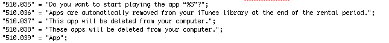

# 苹果将通过应用程序租赁来打击 iOS 盗版？TechCrunch

> 原文：<https://web.archive.org/web/http://techcrunch.com/2011/10/03/app-store-rentals/>

# 苹果将通过应用程序租赁来打击 iOS 盗版？

无论是对兼容性或质量的警惕，可支配收入的缺乏，还是一些不引人注意的抗议形式，人们总是会找到盗版的理由。当然，这些理由中的许多往往都是次要的，因为意识到不付钱比付钱更重要——但是，嘿，我没有资格在这里假装站在任何形式的道德基座上。

在 iOS 盗版领域，最常被引用的理由似乎是“App Store 上的垃圾太多了！在我为一个应用支付一整块钱之前，我怎么知道它是否有用呢？我不是盗版，我是测试！”

好吧，Installous 的粉丝们，看起来你们可能很快就要找到一个新的逻辑来赦免你们的良心了。根据 iTunes 最新测试版中的几个字符串，看起来苹果可能正在破解一种方法，让用户在支付全价之前试用 iOS 应用程序，无需越狱。

由推特爱好者和自称的 iOS 黑客 [Sonny Dickson](https://web.archive.org/web/20230205024937/http://twitter.com/#!/sonnydickson) 发现的新字符串似乎指的是有“租期”的应用程序，在租期结束后会自动删除:

**App 租赁串串**

当然，值得注意的是，这些字符串似乎是直接从 iTunes 电影租赁中复制/粘贴的，但单词“App”被替换为单词“Movie”。问用户是否希望开始“*玩*”应用程序(游戏之外)有点奇怪，不是吗？

如果苹果*真的*推出租赁/试用系统，看看他们如何处理定价会很有趣。App Store 上的许多(如果不是大部分的话)优质服务都是 99 美分。如何合理地出租呢？一周 10 美分？荒谬。该系统将需要支持几乎免费的应用程序的免费租赁(试用),以及允许更昂贵的产品进行有时间限制的安装试验的溢价租赁。