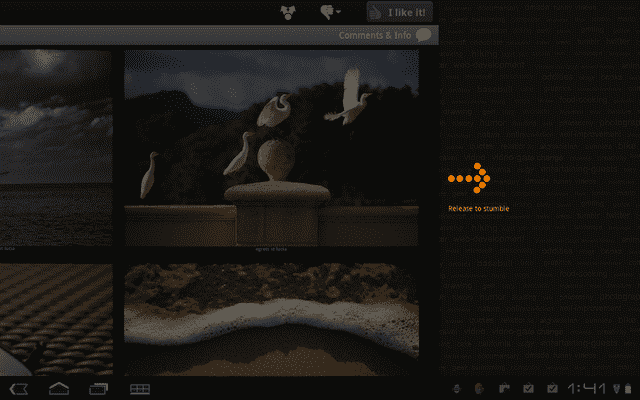
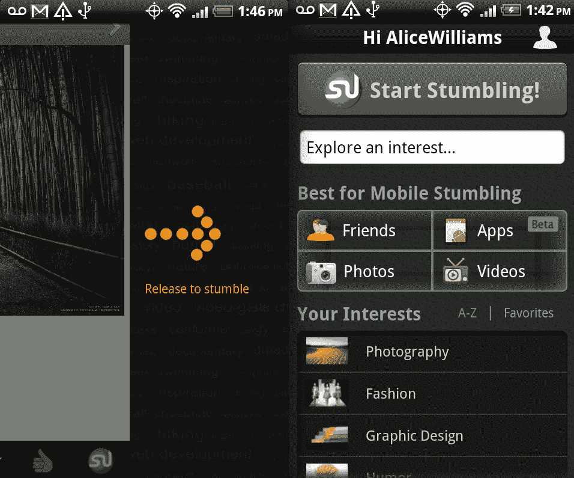

# StumbleUpon 将其平板电脑体验引入 Android，优化其所有移动应用的用户界面 TechCrunch

> 原文：<https://web.archive.org/web/http://techcrunch.com/2011/10/03/stumbleupon-brings-its-tablet-experience-to-android-optimizes-ui-across-all-its-mobile-apps/>

# StumbleUpon 将其平板电脑体验引入 Android，优化其所有移动应用的用户界面

内容发现平台 [StumbleUpon](https://web.archive.org/web/20230203223002/http://www.stumbleupon.com/) ，刚刚在 8 月发布了一款[大幅改进的 iPad 应用程序，现在通过第一款专为 Android 平板电脑设计的 StumbleUpon 应用程序(该应用程序之前仅适用于 Android 手机)将同样的用户体验引入 Android。这款应用已经可以在安卓市场](https://web.archive.org/web/20230203223002/https://techcrunch.com/2011/07/11/stumbleupon-ipad/)[下载了。](https://web.archive.org/web/20230203223002/https://market.android.com/details?id=com.stumbleupon.android.app)

新的 StumbleUpon Android 平板电脑与新的 iPad 应用程序具有基本相同的功能(尽管在第一次运行时，一些滑动功能在 iPad 上似乎更快)。

除了发布 Android 平板电脑版本，StumbleUpon 正在统一所有移动应用程序的功能。最显著的变化是，该公司将把以前只能通过其网络界面使用的探索盒子带到其所有的移动平台上。StumbleUpon 创始人加勒特·坎普告诉我，用户现在可以通过手机浏览超过 50 万个兴趣选项，只需点击他们正在使用的任何应用程序的主页按钮，并在浏览框中输入他们喜欢的兴趣关键词。例如，我选择了“时尚”这个兴趣类别(当然)。

以前只有 iPad 应用程序才有的滑动到绊倒功能现在也是所有移动 StumbleUpon 应用程序的标准功能。该功能允许用户使用 [Flipboard](https://web.archive.org/web/20230203223002/http://www.flipboard.com/) 风格的“滑动”手势来移动到下一段内容。

iPad 应用程序的内容预加载也将出现在所有 StumbleUpon 移动应用程序上，以改善页面加载时间，使磕磕绊绊的体验更快。

Camp 告诉我，StumbleUpon mobile 仍在以每月 35%的速度增长，他认为这是因为人们使用他们的移动设备，特别是平板电脑进行娱乐，“如果你在谈论下个月要去的度假，刷一下‘哥斯达黎加’这个词比完成一次搜索要容易得多，”他说。

“平板电脑更多的是想要娱乐，在平板电脑上浏览的体验非常有趣，”他继续说道。“StumbleUpon 就像拥有自己的个人频道……你自己的个性化互联网之旅。”

Camp 对 StumbleUpon 移动应用的未来计划包括完善当前的 UI 变化，此外还添加了社交通知功能*a la*four square 和 [Instagram](https://web.archive.org/web/20230203223002/http://instagr.am/) 。今天标志着该公司首次实现了所有移动功能的一致性。

