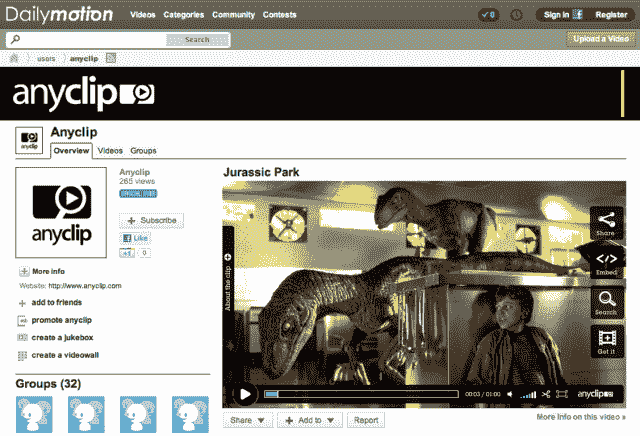

# AnyClip 为 daily motion TechCrunch 带来数以千计的完整电影和电影剪辑

> 原文：<https://web.archive.org/web/http://techcrunch.com/2011/10/04/anyclip-brings-thousands-of-full-films-movie-clips-to-dailymotion/>

# AnyClip 为 Dailymotion 带来了数以千计的完整电影和电影片段

**独家-**据报道，虽然 [YouTube](https://web.archive.org/web/20230205003052/http://www.crunchbase.com/company/youtube) 正在与电影公司和电视网合作，为[的主要内容推送](https://web.archive.org/web/20230205003052/https://techcrunch.com/2011/10/03/youtube-reportedly-forking-out-100m-for-tv-esque-content/)铺平道路，但其不小的竞争对手 [Dailymotion](https://web.archive.org/web/20230205003052/http://www.crunchbase.com/company/dailymotion) 也没有坐以待毙。该公司已经与 AnyClip 签署了一项协议，将数千部完整长度的故事片和 5 万部完全授权的电影剪辑带到其广受欢迎的视频共享平台。

AnyClip 与环球和威望迪等电影公司合作，不久将有更多交易，以获得完整长度的电影，而不仅仅是宣传材料，不像竞争对手 [MovieClips](https://web.archive.org/web/20230205003052/http://www.crunchbase.com/company/movieclips) 。AnyClip 专注于 B2B 模式，与分销合作伙伴合作，在他们的网站上提供许可的剪辑。

该公司表示，AnyClip 的专有标记技术从全长故事片中提取并索引了 5000 多条元数据(包括演员、物体、人物和地点)，甚至能够理解给定场景的情绪和情感基调。

根据 comScore 的数据，Dailymotion 每月迎来约 1.14 亿独立访客，视频浏览量超过 12 亿次。

从今天开始，Dailymotion 用户将可以访问 AnyClip 的超过 50，000 个剪辑的库，这些剪辑来自主要的电影工作室，如环球影业、威望迪娱乐公司和几家独立发行公司。为了体验他们所提供的东西，看看他们的最受欢迎的剪辑列表。

