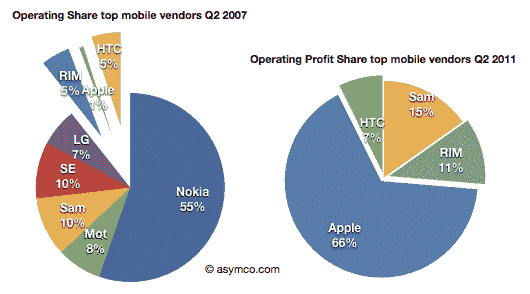
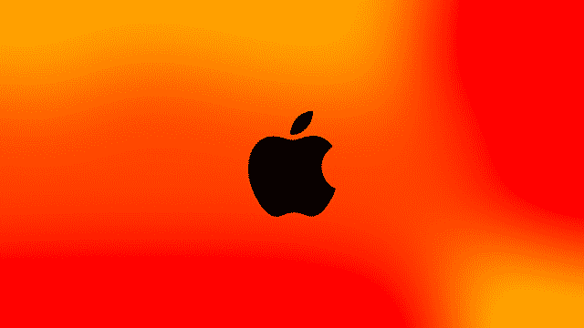

# 苹果宣布“更便宜”的 iPhones:旧款

> 原文：<https://web.archive.org/web/http://techcrunch.com/2011/10/04/apple-announces-cheaper-iphones-the-old-ones/>

尽管有相反的预测，苹果公司今天并没有发布更便宜的大众市场版本的 iPhone。相反，它宣布了一款名为 iPhone 4S 的升级版 iPhone 4。它的外表是一样的，但内部却是全新的。

然而，现在市场上有更多价格实惠的 iPhones:旧款。苹果表示，它将继续保留 iPhone 3GS 和 iPhone 4。不仅如此，它还降低了他们的价格。为什么苹果会让这些老化的设备继续存在？简单。与 Android、Symbian、RIM 和 Windows Phone 竞争——尤其是在新兴市场。

[根据今天的公告](https://web.archive.org/web/20230203103523/https://techcrunch.com/2011/10/04/apple-iphone-event-2011-live/)，iPhone 3GS 现在是免费合约。iPhone 4 已经降到了 99 美元。虽然新的较低价格是基于与移动运营商的两年协议，但手机没有被完全扼杀的事实很重要。

这些是“新的”更便宜的大众市场 iPhones。

苹果没有具体说明这些打折设备将在哪里销售，只是指出 iPhone 4S 将在美国、加拿大、澳大利亚、英国、法国、德国和日本销售。不过，看到这些老款机型被用作苹果进军新兴市场的工具并不奇怪。

原因如下:

购买安卓智能手机的人比购买 iPhones 的人多。这是无可争议的事实。

根据[最近来自 comScore](https://web.archive.org/web/20230203103523/https://techcrunch.com/2011/08/30/android-apple-70-percent-smartphone/) 的估计，安卓在美国的市场份额为 41.8%，苹果为 27%。在 Symbian 仍然占据统治地位的欧洲，Android 的市场份额为 22.3%，iPhone 为 20.3%。在全球范围内，一些分析师认为安卓占据了智能手机市场近 50%的份额。

然而，iPhone 在销量上的不足，在利润上得到了弥补，[在 2011 年的 Q2，占据了三分之二的手机利润](https://web.archive.org/web/20230203103523/http://www.asymco.com/2011/07/29/apple-captured-two-thirds-of-available-mobile-phone-profits-in-q2/)。你甚至可以说苹果不需要提供低价 iPhone——没有它也能做得很好，非常感谢。

然而，对苹果来说，在新兴市场没有业务是它需要应对的挑战。以印度为例，它是仅次于中国的第二大电信市场。根据最近[彭博](https://web.archive.org/web/20230203103523/http://www.bloomberg.com/news/2011-10-02/apple-cedes-surging-india-smartphone-market-to-nokia-rim-tech.html)的一份报告，在印度这个拥有 6.02 亿用户的市场上，苹果仅占印度智能手机出货量的 2.6%。这比运往挪威、比利时或以色列的设备数量还要少。

诺基亚主导着印度市场，46%的出货量在 Q2。就连苦苦挣扎的手机制造商 RIM 在中国的出货量也达到了 15%。而以 bada、Android 和 Windows Phone 设备打天下的三星，达到了 21%(数据来源:IDC)。彭博提到了 iPhone 可用性、广告和印度运营商的问题，后者今年刚刚开始推出 3G 网络。(没有 3G，iPhone 能做的大部分事情，只有在有 Wi-Fi 的情况下才能做得很好。)价格也是一个显而易见的问题。

与此同时，在中国，iPhone 很贵，有时甚至比在美国还贵。考虑到中国在 iPhone 制造和组装中的作用，这很讽刺。它也只能通过中国第二大运营商中国联通获得。然而，7 月的[报道](https://web.archive.org/web/20230203103523/http://online.wsj.com/article/SB10001424052702304223804576447963332660164.html)称苹果公司首席执行官蒂姆·库克(时任首席运营官)希望将 iPhone 引入中国最大的运营商中国移动，中国移动拥有 6 亿用户，而中国联通只有 2 亿。

尽管在这些地区推出存在技术挑战，更不用说来自知名品牌竞争对手和山寨产品的竞争，但苹果知道它不能继续忽视在这些市场竞争的需要。在所有新兴市场中，中国和印度因其庞大的规模而非常重要——毕竟，苹果的收入并非全部来自设备销售。未能占领这些地区的市场份额，只是错过了创收的机会。

就连库克在苹果最近的收益电话会议上也承认，中国对苹果在亚太地区的增长非常重要，对公司的整体业绩也非常重要。根据库克的说法，iPhone 在中国的销售是苹果本季度 88 亿美元收入的“关键驱动力”。中国的苹果商店拥有世界上最高的客流量(是美国同行的 4 倍)和最高的收入。

今天，[在苹果主题演讲](https://web.archive.org/web/20230203103523/https://techcrunch.com/2011/10/04/tim-cook-iphone-has-5-of-mobile-phone-marketshare-worldwide-an-enormous-opportunity/)中，库克谈到了上周在亚洲新开的两家零售店:香港和上海。这家上海店现在是亚洲最大的店，开业周末就有 10 万名游客。相比之下，洛杉矶商店花了一个月才达到同样的数字。

因此，虽然在这些市场上“更便宜”的 iPhone 意味着苹果硬件的利润率更低，但市场的巨大规模意味着有机会通过设备销售潜力来弥补这一损失。

竞争对手 Android、RIM、诺基亚和 Windows Phone 经常在价格上与 iPhone 竞争，因为他们的应用生态系统和内容业务(例如，Zune 不是 iTunes，谷歌音乐甚至不卖歌曲)与苹果相比仍然缺乏。随着价格的消失，苹果的增长潜力已经发生了根本性的变化。

换句话说，凭借新款 iPhone 4S，苹果继续迎合那些无论如何都会升级的高端人群。通过 iPhone 4 和 3GS，苹果追求的是想要任何类型智能手机的市场，只要它是负担得起的。它的目标是那些想要 iPhone 但没钱的人。

尽管如此，考虑到有数百种 Android 设备，而只有这三种 iPhone 型号，仅打折的 iPhone 可能不足以让苹果在智能手机市场占据领先地位。不过，显而易见的是，这至少会削弱 Android 看似不可阻挡的市场份额增长。

哦，还有[新款 Sprint iPhone](https://web.archive.org/web/20230203103523/https://techcrunch.com/2011/10/04/apple-officially-announces-the-iphone-4s/) 也不会疼。

*图片来源: [asymco](https://web.archive.org/web/20230203103523/http://www.asymco.com/2011/07/29/apple-captured-two-thirds-of-available-mobile-phone-profits-in-q2/) ，苹果*